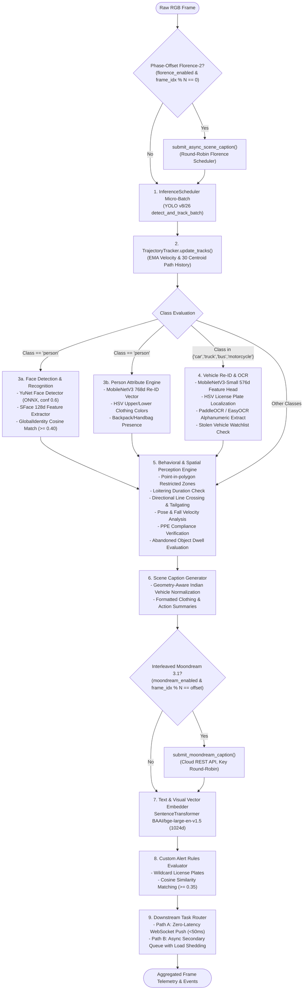

# AI Models & Multimodal Pipelines — Sybau VMS Pro

> **Complete technical specification of AI/ML architectures, models, inference schedulers, and computer vision pipelines in Sybau VMS Pro.**

---

## Table of Contents
1. [Master End-to-End Inference Orchestration](#1-master-end-to-end-inference-orchestration)
2. [Object Detection & Tracking (YOLO + ByteTrack)](#2-object-detection--tracking-yolo--bytetrack)
3. [Facial Biometrics & Recognition (YuNet + SFace)](#3-facial-biometrics--recognition-yunet--sface)
4. [Vehicle Re-ID & License Plate OCR (MobileNetV3 + PaddleOCR)](#4-vehicle-re-id--license-plate-ocr-mobilenetv3--paddleocr)
5. [Person Re-ID & Attribute Classification Engine](#5-person-re-id--attribute-classification-engine)
6. [Scene Captioning & Vision-Language Models (Florence-2 / Moondream 3.1)](#6-scene-captioning--vision-language-models-florence-2--moondream-31)
7. [Dense Text & Semantic Embeddings (SentenceTransformer)](#7-dense-text--semantic-embeddings-sentencetransformer)
8. [Acoustic Intelligence & Anomaly Engine (16kHz PCM FFT/RMS)](#8-acoustic-intelligence--anomaly-engine-16khz-pcm-fftrms)
9. [Advanced Spatial Analytics & Perception Suite](#9-advanced-spatial-analytics--perception-suite)
10. [Adaptive Statistical Baseline Engine](#10-adaptive-statistical-baseline-engine)
11. [Indian Traffic Geometry Normalizer](#11-indian-traffic-geometry-normalizer)

---

## 1. Master End-to-End Inference Orchestration

Every sampled frame processed by `CameraAIWorker` passes through `backend/ai/pipeline/orchestrator.py`:

---

## 2. Object Detection & Tracking (YOLO + ByteTrack)

- **Source**: `backend/ai/model_manager.py:96-126`, `backend/ai/detection/yolo.py`
- **Default Model Weights**: `yolo26l.pt` / `yolo26m.pt` (configurable via `configs/models.json -> yolo.model_path`).
- **Inference Hardware**: NVIDIA CUDA (`float16` accelerated) with CPU fallback.
- **Tracker**: `bytetrack.yaml` maintaining track continuity across occlusions and motion blur.
- **Track Smoothing**: `TrajectoryTracker` calculates Exponential Moving Average (EMA) velocity in px/s and maintains a sliding centroid path history of the last 30 positions.
- **COCO Class Filtering**: Restricts detections to surveillance target classes (`person`, `bicycle`, `car`, `motorcycle`, `bus`, `truck`, `backpack`, `handbag`, `suitcase`).
- **Confidence Threshold**: Configured via `configs/models.json -> yolo.conf` (default: `0.35`).

---

## 3. Facial Biometrics & Recognition (YuNet + SFace)

- **Source**: `backend/ai/face/face_pipeline.py`
- **Face Detector**: YuNet ONNX (`cv2.FaceDetectorYN`, `models/face_detection_yunet_2023mar.onnx`).
  - Score Threshold: `0.60`
  - NMS IOU Threshold: `0.30`
  - Maximum Faces per Frame: `100`
- **Face Recognizer**: SFace ONNX (`cv2.FaceRecognizerSF`, `models/face_recognition_sface_2021dec.onnx`).
  - Output Representation: 128-dimensional dense float vector (L2-normalized).
  - Cross-Camera Identity Matching: Cosine similarity $\ge 0.40$ (`backend/services/identity.py`).
  - Storage: Qdrant vector space `face` (Cosine distance).

---

## 4. Vehicle Re-ID & License Plate OCR (MobileNetV3 + PaddleOCR)

- **Source**: `backend/ai/vehicle/vehicle_reid.py`, `backend/ai/model_manager.py:128-183`
- **Vehicle Feature Extractor**: `torchvision.models.mobilenet_v3_small` with classifier head replaced by `Identity()` (576-dimensional feature vector).
- **License Plate Localization**: Dual-stage HSV color segmentation isolating Indian High-Security Registration Plates (HSRP - Yellow commercial / White private) with aspect ratio filtering ($1.5 \le w/h \le 8.0$).
- **OCR Hierarchy**:
  1. **Primary**: PaddleOCR v3.x (`use_textline_orientation=False`) on CUDA.
  2. **Fallback**: EasyOCR English text detector.
  3. **Local Dev / Mock**: Deterministic pattern extractor.
- **Plate Post-Processing**: Regex cleaning removing non-alphanumeric noise, normalizing Indian state code prefixes (`GJ`, `MH`, `DL`, `KA`, `UP`, `HR`).
- **Hot-List Verification**: Instant cross-referencing against State CCTNS stolen vehicle registry (`backend/services/watchlist/matcher.py`).

---

## 5. Person Re-ID & Attribute Classification Engine

- **Source**: `backend/ai/person/person_reid.py`, `backend/ai/person/person_attribute_engine.py`
- **Re-ID Model**: MobileNetV3 (768-dimensional normalized embedding stored in Qdrant `person_crop` space).
- **Upper / Lower Clothing Color**: Segmented HSV histogram analysis classifying 10 dominant color categories (`red`, `blue`, `black`, `white`, `yellow`, `green`, `brown`, `pink`, `orange`, `grey`).
- **Posture & Action Classification**: Evaluates bounding box aspect ratios and centroid displacements to detect standing, sitting, running, or fallen postures.
- **Accessory Detection**: Identifies backpacks, handbags, and luggage co-located on person crops.

---

## 6. Scene Captioning & Vision-Language Models (Florence-2 / Moondream 3.1)

Sybau VMS Pro features an **Interleaved Dual-VLM Architecture** providing dense natural language descriptions of complex surveillance scenes:

### 6.1 Florence-2 Local VLM
- **Model**: `microsoft/Florence-2-base` (transformers).
- **Prompt**: `<MORE_DETAILED_CAPTION>`
- **Precision**: `torch.float16` on CUDA (CPU fallback: `float32`).
- **Batching & Scheduling**: `FlorenceRoundRobinScheduler` dispatches 2 cameras per batch at a minimum 0.5s interval.
- **Windows Flash-Attention Patch**: Stubs `flash_attn` imports to prevent startup crashes on Windows environments.
- **Cryptographic Binding**: `caption_integrity.py` binds every Florence-2 caption to the SHA-256 hash of its source image frame.

### 6.2 Moondream 3.1 Cloud VLM API
- **Endpoint**: `https://api.moondream.ai/v1/query`
- **Target Model**: `moondream3.1-9B-A2B`
- **API Key Pool**: Round-robin rotation across multiple comma-separated keys (`MOONDREAM_API_KEYS`).
- **Phase-Offset Interleaving**: Executes on half-phase offset frames (`frame_idx % 30 == 15`) relative to Florence-2 (`frame_idx % 30 == 0`), preventing GPU and network bottlenecks.

---

## 7. Dense Text & Semantic Embeddings (SentenceTransformer)

- **Source**: `backend/ai/embeddings/embedder.py`
- **Model**: `BAAI/bge-large-en-v1.5`
- **Embedding Dimension**: 1024-dimensional dense float vector.
- **Caching**: Thread-safe in-process LRU dictionary cache.
- **Vector Space**: Qdrant `scene` space (Cosine distance metric).

---

## 8. Acoustic Intelligence & Anomaly Engine (16kHz PCM FFT/RMS)

- **Source**: `backend/ai/audio/acoustic_engine.py`
- **Input**: 16-bit mono 16kHz PCM audio stream processed in 1-second sliding windows with 50% overlap.
- **Spectral Feature Extraction**:
  - **RMS Energy (dBFS)**: $120.0 + 20 \log_{10}(\text{RMS})$
  - **FFT Peak Frequency (Hz)**: Fast Fourier Transform peak spectral magnitude
  - **Spectral Centroid**: Energy-weighted average frequency
  - **Zero Crossing Rate (ZCR)**: Sign-change frequency per second
- **Acoustic Classifier Signatures**:
  - `gunshot`: $\ge 95$ dBFS, peak freq $1000 - 3500$ Hz
  - `explosion`: $\ge 95$ dBFS, peak freq $< 1000$ Hz
  - `glass_break`: $\ge 95$ dBFS, peak freq $> 3500$ Hz
  - `scream`: $\ge 80$ dBFS, peak freq $2000 - 5500$ Hz
  - `alarm`: $\ge 82$ dBFS, peak freq $> 4000$ Hz
- **Temporal Smoothing**: Requires 2 out of 3 consecutive windows to agree on an anomaly before firing an alert. Emits canonical `AudioEvent` and broadcasts to WebSocket.

---

## 9. Advanced Spatial Analytics & Perception Suite

- **Source**: `backend/ai/behavior/spatial_analytics.py`, `backend/services/detectors/abandoned_object.py`

| Analytic Module | Algorithm / Mathematics | Trigger Criteria |
|---|---|---|
| **Directional Line Crossing** | 2D Vector Cross Product: $(L_{x2}-L_{x1})(P_{y2}-P_{y1}) - (L_{y2}-L_{y1})(P_{x2}-P_{x1})$ | Detects `OUTSIDE_TO_INSIDE` vs `INSIDE_TO_OUTSIDE` crossing. |
| **Tailgating Interval** | Temporal delta: $\Delta t = t_{\text{unauthorized}} - t_{\text{authorized}}$ | $\Delta t \le 3.0\text{ seconds}$ through an authorized access zone. |
| **Pose & Fall Detection** | Downward Keypoint Velocity: $v_y = \Delta y / \Delta t$ + Horizontal Aspect Ratio ($w/h > 1.2$) | $v_y > 120\text{ px/s}$ transitioning into horizontal posture. |
| **PPE Safety Compliance** | Head & Torso HSV color masks (Yellow hard hat, High-Vis Orange/Green vest) | Safety gear color ratio $< 5\%$ of crop region triggers `FAIL`. |
| **Queue Dwell Analytics** | Sliding zone occupant tracking: $t_{\text{dwell}} = t_{\text{now}} - t_{\text{entry}}$ | Computes average and maximum waiting times across queue zones. |
| **Parking Overstay** | Polygon spot occupancy tracking: $t_{\text{parked}} = t_{\text{now}} - t_{\text{occupied}}$ | $t_{\text{parked}} > \text{threshold}$ (default: 3600s). |
| **Abandoned Objects** | Stationary object tracking ($<30\text{px}$ displacement for $\ge 60\text{s}$) with nearest person Euclidean distance | Distance to nearest person $> 150\text{px}$ triggers `ABANDONED_OBJECT`. |

---

## 10. Adaptive Statistical Baseline Engine

- **Source**: `backend/ai/behavior/adaptive_baseline.py`
- **Methodology**: Calculates running statistical mean ($\mu$) and standard deviation ($\sigma$) of occupant and vehicle counts per camera for each hour of the day ($0 \dots 23$).
- **Anomaly Detection**:
  $$Z = \frac{X_{\text{current}} - \mu}{\sigma}$$
- **Threshold**: $Z \ge 3.0$ triggers an `ANOMALOUS_ACTIVITY` canonical event with confidence score $\min(0.99, Z/5.0)$.

---

## 11. Indian Traffic Geometry Normalizer

- **Source**: `backend/ai/pipeline/orchestrator.py:93-103`
- **Problem**: Standard COCO-trained YOLO models routinely misclassify Indian three-wheeler auto-rickshaws as trucks or cars due to unfamiliar rooflines.
- **Solution**: Evaluates bounding box aspect ratio ($0.75 \le w/h \le 1.45$) on vehicle detections and automatically remaps misclassified `truck` and `car` labels to `auto_rickshaw`, preventing false alarms and ensuring accurate vehicle ledgers.
