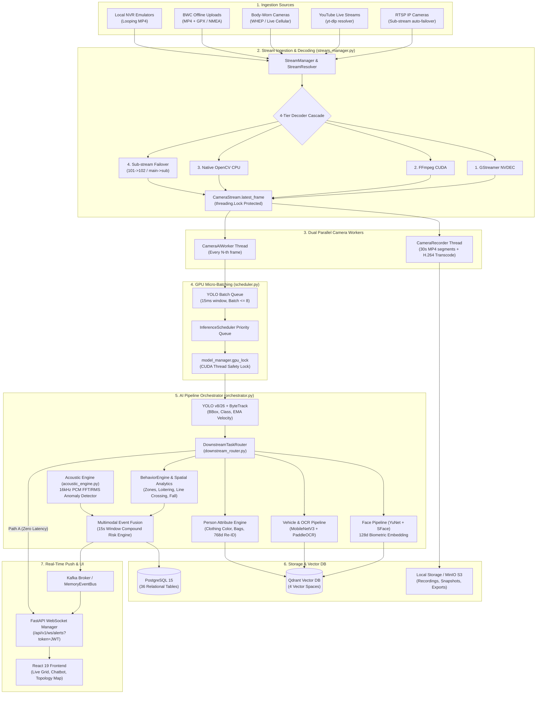
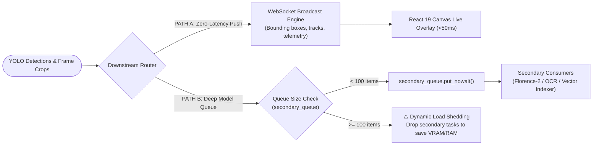

# System Architecture — Sybau VMS Pro

> **Master architectural specification for the Sybau AI Video Management System (VMS Pro / PS-11).**
> Ground-truth reference for developers, DevOps engineers, and system architects.

---

## Table of Contents
1. [High-Level Architectural Overview](#1-high-level-architectural-overview)
2. [End-to-End System Topology Diagram](#2-end-to-end-system-topology-diagram)
3. [Concurrency Model & Thread Safety](#3-concurrency-model--thread-safety)
4. [Dual-Path Downstream Processing & Load Shedding](#4-dual-path-downstream-processing--load-shedding)
5. [Multi-Tenancy & Data Segregation](#5-multi-tenancy--data-segregation)
6. [Data Pipeline Stages](#6-data-pipeline-stages)
7. [Frontend Architecture & Design System](#7-frontend-architecture--design-system)
8. [Event Bus & Real-Time Push Subsystem](#8-event-bus--real-time-push-subsystem)

---

## 1. High-Level Architectural Overview

Sybau VMS Pro is an enterprise-grade, real-time AI surveillance and forensic investigation platform designed for high-density smart city deployments (calibrated for Surat, Gujarat, India).

The architecture separates concerns into seven discrete layers:
1. **Video Ingestion & Hardware Decoding**: Handles multi-protocol streams (RTSP, HLS, WebRTC/WHEP, YouTube, Body-Worn Cameras, local NVR files) with a 4-tier hardware decoder cascade (`GStreamer NVDEC` $\rightarrow$ `FFmpeg CUDA` $\rightarrow$ `Native OpenCV CPU` $\rightarrow$ `Sub-stream Failover`).
2. **GPU Scheduling & Micro-Batching**: Serializes PyTorch/CUDA operations under a unified lock and dynamic 15ms batch queue to eliminate VRAM deadlocks.
3. **Multimodal AI Perception**: Executes real-time object detection (YOLO), multi-object tracking (ByteTrack), facial biometrics (YuNet + SFace), vehicle Re-ID & license plate OCR (MobileNetV3 + PaddleOCR/EasyOCR), scene captioning (Florence-2 / Moondream 3.1), and acoustic DSP analysis (16kHz PCM sliding window).
4. **Behavioral & Spatial Analytics**: Evaluates 2D point-in-polygon rules, directional line-crossing, tailgating, fall detection, PPE compliance, queue dwell times, and statistical hourly anomaly z-scores.
5. **Persistence & Vector DB**: Dual-tier storage using PostgreSQL 15 (36 relational models) and Qdrant (4 isolated vector spaces: `face`, `vehicle`, `person_crop`, `scene`).
6. **Investigation Copilot & Chat Engine**: Multi-turn conversational reasoning with Hinglish/Gujlish intent parsing, multimodal image queries, trajectory timeline playback, and 18 controlled tool interfaces.
7. **Tactical UI Layer**: React 19 SPA with customizable glassmorphism themes, top-header threat HUD, interactive camera topology canvas, and live WebSocket alert streaming.

---

## 2. End-to-End System Topology Diagram



---

## 3. Concurrency Model & Thread Safety

The backend concurrency model balances CPU-bound decoding, I/O-bound disk writes, network WebSockets, and GPU-bound tensor operations:

```
┌─────────────────────────────────────────────────────────────────────────────┐
│                            FASTAPI / UVICORN MAIN LOOP                      │
│   - Async HTTP request handlers (routes)                                    │
│   - WebSocket alert broadcaster (broadcast_event_to_websockets)             │
│   - Lifespan startup/shutdown orchestrator                                  │
└───────────────────────┬─────────────────────────────────────────────────────┘
                        │ Spawns isolated daemon threads
       ┌────────────────┴──────────────────────────────┐
       ▼                                               ▼
┌───────────────────────────────┐       ┌─────────────────────────────────────┐
│   PER-CAMERA INGESTION LOOPS  │       │       AI STARTUP DAEMON THREAD      │
│   (CameraStream._capture_loop)│       │             (AI_Startup)            │
│   - Dedicated thread/camera   │       ├─────────────────────────────────────┤
│   - Hardware decode cascade   │       │ 1. Pre-warm YOLO, OCR, Embedder     │
│   - Atomic frame buffer update│       │ 2. Init Qdrant & Kafka Topics       │
│   - Exponential backoff (2-60s│       │ 3. Start CameraRecorder threads     │
└──────────────┬────────────────┘       │ 4. Start CameraAIWorker threads     │
               │                        │ 5. Start Retention & Moondream      │
               ▼                        │ 6. Delayed Florence pre-warm (5s)   │
┌───────────────────────────────┐       └─────────────────────────────────────┘
│    DUAL CAMERA WORKERS        │
│ 1. CameraRecorder Thread:     │
│    - 30s MP4 segment writes   │
│    - H.264 keyframe alignment │
│ 2. CameraAIWorker Thread:     │
│    - Periodic frame sampling  │
│    - Enqueues to Scheduler    │
└──────────────┬────────────────┘
               │
               ▼
┌─────────────────────────────────────────────────────────────────────────────┐
│                       INFERENCE SCHEDULER & GPU LOCK                        │
│   - InferenceScheduler collects requests into _yolo_queue                   │
│   - Dynamic batch accumulation: max 8 frames or 15ms window                 │
│   - All CUDA inference calls acquire model_manager.gpu_lock                 │
│   - Prevents CUDA context corruption and VRAM thread contention             │
└─────────────────────────────────────────────────────────────────────────────┘
```

---

## 4. Dual-Path Downstream Processing & Load Shedding

Heavy downstream models (Florence-2, Moondream 3.1, deep person attribute embeddings) must never introduce latency into the live UI bounding-box overlays. The system uses a **Dual-Path Downstream Router** (`backend/ai/routing/downstream_router.py`):



---

## 5. Multi-Tenancy & Data Segregation

All database tables and event schemas are designed with multi-tenancy support:
- `organization_id` (default: `"org_default"`): Segregates data between police departments, municipal authorities, or private enterprise tenants.
- `site_id` (default: `"site_main"`): Subdivides organizational resources by geographic zone, police station jurisdiction, or facility campus.

Every data model (`users`, `cameras`, `events`, `tracks`, `faces`, `vehicles`, `raw_ocr_records`, `zones`, `custom_alert_rules`, `global_identities`, `person_journey_events`, `vehicle_journey_events`, `audio_events`, `privilege_elevation_requests`, `unified_sightings`, `event_rules`) includes indexed `organization_id` and `site_id` columns to ensure strict tenant isolation during multi-tenant queries.

---

## 6. Data Pipeline Stages

The platform processes data through seven sequential stages:

```
[Stage 1: Ingestion]  ──> Multi-protocol video & audio ingestion with decoder failover
[Stage 2: Batching]   ──> 15ms micro-window dynamic GPU batch accumulation
[Stage 3: Vision/DSP] ──> YOLO detection + ByteTrack + Facial Re-ID + ALPR + Audio FFT
[Stage 4: Spatial]    ──> Point-in-polygon, directional line crossing, fall, PPE, z-scores
[Stage 5: Fusion]     ──> 15-second multi-modal correlation window compound risk evaluation
[Stage 6: Indexing]   ──> Qdrant multi-space vector indexing & PostgreSQL relational ledger
[Stage 7: Dispatch]   ──> Kafka/WebSocket alert push, UI updates, and webhook automation
```

---

## 7. Frontend Architecture & Design System

The frontend is a modular React 19 Single Page Application (SPA) built with Vite, Material-UI (MUI v6), and custom glassmorphism design tokens:

### Component Topology
- `App.jsx`: Global shell, JWT authentication state, responsive drawer navigation, top-header threat HUD, IST real-time clock, AI subsystem status indicator, and floating AI Copilot chatbot.
- `LiveGrid.jsx`: Multi-camera interactive monitoring grid with HLS/WebRTC/MJPEG rendering, dynamic aspect ratios, PTZ controls, and live bounding-box canvas overlays.
- `RecordsConsole.jsx`: Comprehensive captured records ledger (Faces, Vehicles, License Plates, Scene Captions, Raw OCR, AI Skill Assignments) with pagination, search, and sorting.
- `AlertsPanel.jsx`: Real-time tactical alert feed with audio chime alerts, severity filtering, operator acknowledgment, and direct forensic ZIP evidence export.
- `InvestigationSearch.jsx`: Unified multimodal search interface supporting natural language semantic queries, license plate regex search, biometric face uploads, and visual image queries.
- `TrajectoryMap.jsx`: Cross-camera GPS suspect trajectory routes, subject route playback, co-occurrence cluster inspection, and convoy analysis.
- `TopologyEditor.jsx`: Interactive camera topological network editor with draggable node positioning, directed transit edge configuration, and travel time window calibration.
- `AIChatbot.jsx`: Floating conversational surveillance copilot supporting multi-turn queries in English, Hindi, and Gujarati, image upload searches, trajectory timeline cards, and visual citations.
- `WatchlistManager.jsx`: Stolen vehicle hot-list and biometric wanted person watchlist management with DPDP Act 2023 compliance auditing and retention purge controls.
- `ForensicsManager.jsx`: Forensic evidence package generator, SHA-256 integrity verifier, court-admissible HTML FIR annexures, and E-Challan citations with QR codes.
- `DiscoveryScanner.jsx`: ONVIF WS-Discovery UDP network scanner with SOAP profile extraction and RTSP endpoint resolution.
- `ArchivePlayback.jsx`: Historical NVR recording playback with timeline scrubbing and calendar date navigation.
- `AdminConsole.jsx`: User management, RBAC configuration, temporary privilege elevation review workflow, and paginated audit logs.
- `SettingsConsole.jsx`: AI model configuration, Florence/Moondream toggles, privacy redaction controls, theme personalization, and alert thresholds.

### Theme Tokens (`themeMode`)
1. `stark-dark`: Pure black (`#000000`) background with ultra-clean white contrast (`#ffffff`) and subtle borders (`#232323`).
2. `stark-light`: High-contrast pure white (`#ffffff`) theme for brightly lit control rooms.
3. `emerald`: Tactical cyber-green matrix theme (`#00e676`) optimized for nighttime surveillance operations.
4. `amber`: High-visibility tactical amber theme (`#ffb300`).

---

## 8. Event Bus & Real-Time Push Subsystem

Real-time events and telemetry flow through a hybrid event bus architecture:
- **Primary Bus (Production)**: Apache Kafka cluster publishing to dedicated topics: `alerts`, `captions`, `tracks`, `vehicles`.
- **Fallback Bus (Development / Standalone)**: High-performance in-memory event bus (`MemoryEventBus`) maintaining subscriber callbacks without external infrastructure dependencies.
- **WebSocket Gateway (`/api/v1/ws/alerts`)**: Validates client JWT tokens upon handshake (`?token=<jwt>`), checks active user status, and broadcasts thread-safe JSON payloads to all connected operator consoles.
