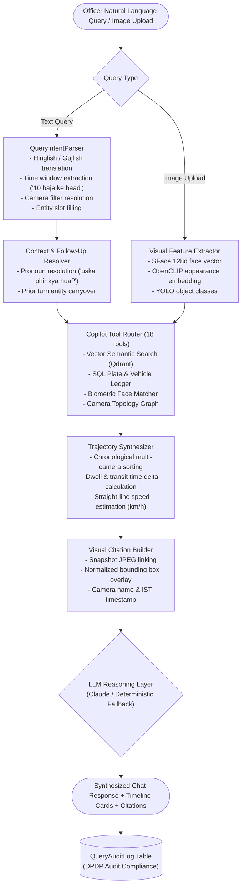

# AI Copilot & Conversational Chatbot — Sybau VMS Pro

> **Comprehensive guide to the Conversational Surveillance AI Chatbot, Natural Language Copilot, and Multilingual Query Engine.**

---

## Table of Contents
1. [Overview & Core Architecture](#1-overview--core-architecture)
2. [Natural Language Intent Parser & Multilingual Translation](#2-natural-language-intent-parser--multilingual-translation)
3. [Multi-Turn Follow-Up & Pronoun Resolution](#3-multi-turn-follow-up--pronoun-resolution)
4. [Multimodal Visual Image Search](#4-multimodal-visual-image-search)
5. [Trajectory Timeline Synthesis & Speed Estimation](#5-trajectory-timeline-synthesis--speed-estimation)
6. [Visual Evidence Citations Schema](#6-visual-evidence-citations-schema)
7. [Controlled Tool Interfaces (18 Tools)](#7-controlled-tool-interfaces-18-tools)
8. [Forensic Investigation Report Generation](#8-forensic-investigation-report-generation)
9. [DPDP Query Audit Trail & Session Memory](#9-dpdp-query-audit-trail--session-memory)

---

## 1. Overview & Core Architecture

The AI Copilot subsystem (`backend/services/copilot/`, `backend/routers/copilot.py`, `backend/routers/chat.py`) provides an intelligent, multi-turn conversational interface for police officers, dispatchers, and forensic investigators.

It enables natural language investigation across hundreds of camera feeds simultaneously, synthesizing complex relational sightings, vector embeddings, license plate reads, and trajectory maps into plain-language answers with verified visual citations.



---

## 2. Natural Language Intent Parser & Multilingual Translation

- **Source**: `backend/services/copilot/multilingual_matcher.py`, `backend/services/copilot/chat_engine.py:148-250`

The system features native understanding of **English**, **Hindi (Devanagari & Romanized Hinglish)**, and **Gujarati (Gujarati Script & Romanized Gujlish)** without requiring separate GPU translation models:

### 2.1 Vocabulary Mapping Matrix
- **Colors**:
  - Hindi: *laal / lal* $\rightarrow$ red, *neela / nila* $\rightarrow$ blue, *kaala / kala* $\rightarrow$ black, *safed / chitta* $\rightarrow$ white, *peela / pila* $\rightarrow$ yellow, *hara* $\rightarrow$ green, *gulabi* $\rightarrow$ pink, *bhura* $\rightarrow$ brown
  - Gujarati: *lal* $\rightarrow$ red, *kalo / kali* $\rightarrow$ black, *safed / dholo* $\rightarrow$ white, *pilo / pili* $\rightarrow$ yellow, *leelo / lilo* $\rightarrow$ green, *vaadli* $\rightarrow$ blue
- **Entities & Clothing**:
  - Hindi: *banda / aadmi / ladka* $\rightarrow$ person man, *aurat / mahila / ladki* $\rightarrow$ woman, *bacha* $\rightarrow$ child, *kamiz / kapde / kurta* $\rightarrow$ clothing, *pant / jeans* $\rightarrow$ pants, *jhola / basta* $\rightarrow$ backpack
  - Gujarati: *manas / chokro* $\rightarrow$ person man, *chokri* $\rightarrow$ woman, *kurto / kapda* $\rightarrow$ clothing
- **Vehicles**:
  - *gaadi / gadi* $\rightarrow$ car, *activa / bike / scooty* $\rightarrow$ motorcycle, *auto / rickshaw / tuktuk* $\rightarrow$ auto-rickshaw
- **Time Indicators**:
  - *10 baje ke baad* / *10 vagya pachhi* $\rightarrow$ `time_start = "10:00:00"`

### 2.2 Supported Tactical Patterns
1. **Clothing + Color + Time Person Search**: *"Laal shirt wala banda 10 baje ke baad station par dikha tha kya?"* $\rightarrow$ `find person wearing red shirt after 10:00`
2. **Vehicle + Plate / Color Search**: *"Gaadi number DL01AB1234 kahan spot hui?"* $\rightarrow$ `find vehicle with plate DL01AB1234`
3. **Missing Person / POI Search**: *"Gumshuda vyakti Vikram khojo"* $\rightarrow$ `find missing person Vikram`

---

## 3. Multi-Turn Follow-Up & Pronoun Resolution

- **Source**: `backend/services/copilot/chat_engine.py:400-480`

Investigators often ask follow-up questions referencing previous turns (e.g. *"Where did he go next?"*, *"Uska number plate kya tha?"*).

The context engine inspects the last 6 turns in `chat_messages` to resolve references:
1. Detects pronouns: `he`, `she`, `they`, `it`, `suspect`, `target`, `uska`, `uski`, `unka`, `gadi`.
2. Inherits subject attributes (license plate, clothing color, track UUID, face identity) from the preceding turn.
3. Automatically constrains search time window to after the last sighting timestamp ($\ge t_{\text{last}}$).

---

## 4. Multimodal Visual Image Search

- **Source**: `backend/routers/chat.py:65`, `backend/routers/search.py:124`

Investigators can upload a photograph (e.g. CCTV snapshot, mobile photo of a missing child, witness snapshot of a getaway vehicle) along with optional natural language instructions:
1. **Biometric Face Vector Extraction (<10ms)**: YuNet detects face and SFace extracts 128d vector, querying Qdrant `face` collection.
2. **Visual Appearance / Clothing Embedding (<15ms)**: OpenCLIP extracts full-body appearance vector, querying Qdrant `person_crop` collection.
3. **Object Classification (<10ms)**: Fast YOLO pass identifies vehicle or accessory classes.
4. **Ranked Fusion**: Merges face similarity scores with appearance and scene embeddings to return a deduplicated, high-confidence sighting gallery.

---

## 5. Trajectory Timeline Synthesis & Speed Estimation

- **Source**: `backend/services/copilot/chat_engine.py:550-680`

When an investigation matches sightings across multiple cameras, the Copilot automatically generates a structured **Trajectory Timeline**:
- **Chronological Sorting**: Sequences sightings from earliest arrival to latest departure.
- **Dwell Time Calculation**: Computes duration spent in each camera field of view.
- **Estimated Travel Speed**: When cameras have calibrated GPS coordinates (`latitude`, `longitude`), calculates straight-line distance via Haversine formula and computes speed:
  $$v_{\text{km/h}} = \frac{\Delta d_{\text{meters}}}{\Delta t_{\text{seconds}}} \times 3.6$$
- **Backtracking / Directional Reversal Warnings**: Automatically flags if a suspect reverses direction or lingers suspiciously between adjacent nodes.

---

## 6. Visual Evidence Citations Schema

Every conversational claim generated by Copilot is backed by immutable visual citations (`citations_json`):

```json
[
  {
    "citation_id": "CIT_01",
    "camera_id": "cyber_cam_1",
    "camera_name": "Kharvarnagar BRTS Junction, Surat",
    "timestamp": "2026-08-16T11:15:32+05:30",
    "snapshot_url": "/api/v1/playback/snapshot/TRK_cyber_cam_1_88",
    "confidence": 0.96,
    "bbox": [0.35, 0.42, 0.18, 0.31],
    "matched_entity": "Black SUV (DL01AB1234)",
    "source_type": "anpr_ocr"
  }
]
```

---

## 7. Controlled Tool Interfaces (18 Tools)

Copilot interacts with the system strictly through 18 secure, deterministic tool interfaces (`backend/services/copilot/copilot_agent.py`):

1. `search_semantic_scene`: Dense vector cosine search over scene captions.
2. `search_license_plate`: Alphanumeric plate query with SQL regex and wildcard parsing.
3. `search_face_biometrics`: Cosine similarity query on Qdrant `face` collection.
4. `get_camera_telemetry`: Fetches live FPS, person counts, and stream status.
5. `query_vehicle_ledger`: Queries vehicle make, model, dominant HSV color, and timestamps.
6. `query_person_attributes`: Queries upper/lower clothing colors, gender, posture, and bags.
7. `get_subject_trajectory`: Reconstructs multi-camera GPS route and timeline.
8. `get_camera_topology`: Queries connected camera nodes and calibrated travel windows.
9. `predict_escape_routes`: Calculates next-hop interception points and arrival ETAs.
10. `get_stolen_vehicle_hotlist`: Cross-checks vehicle plates against CCTNS stolen vehicle feed.
11. `get_wanted_person_watchlist`: Cross-checks faces against wanted criminals and missing persons.
12. `get_co_occurrence_clusters`: Inspects convoy and accomplice candidate groups.
13. `query_acoustic_events`: Searches audio anomaly records (gunshots, screams, glass breaks).
14. `get_camera_baseline_anomaly`: Evaluates hourly statistical occupancy z-scores.
15. `query_zone_intrusions`: Queries polygon ROI perimeter breach events.
16. `query_tailgating_events`: Queries unauthorized access following events.
17. `export_forensic_clip`: Generates SHA-256 signed evidence MP4 package.
18. `generate_fir_annexure`: Synthesizes court-admissible HTML FIR evidence annexure.

---

## 8. Forensic Investigation Report Generation

- **Source**: `backend/services/copilot/report_generator.py`
- **Endpoint**: `GET /api/v1/copilot/report/{investigation_id}`
- **Output**: Formal HTML/PDF forensic report containing:
  - Official case header and investigating officer credentials.
  - Complete natural language query and synthesized findings.
  - Executed tool trace and matched event UUIDs.
  - Chronological multi-camera trajectory map table with GPS coordinates.
  - High-resolution visual citation snapshots with bounding boxes.
  - Digital SHA-256 provenance signature for court admissibility under Indian Bharatiya Sakshya Adhiniyam (BSA) / Indian Evidence Act Section 65B.

---

## 9. DPDP Query Audit Trail & Session Memory

To ensure compliance with the **Digital Personal Data Protection (DPDP) Act 2023**:
- Every query executed in Copilot or Chatbot is logged immutably to `query_audit_logs` (`QueryAuditLog`), recording `session_uuid`, `username`, `query_text`, `search_mode`, `matched_records_count`, `matched_sighting_ids`, `ip_address`, and `execution_time_ms`.
- Sessions are persisted in `chat_sessions` and `chat_messages` with user ownership isolation, allowing operators to resume prior multi-hour investigations seamlessly.
