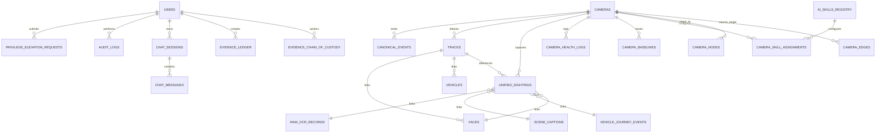

# Database Schema & Data Models — Sybau VMS Pro

> **Comprehensive database schema specification for Sybau VMS Pro.**
> Covers all 36 SQLAlchemy models, multi-tenancy columns, compound indexes, foreign key relationships, and the automated migration system.

---

## Table of Contents
1. [Overview & Migration Architecture](#1-overview--migration-architecture)
2. [Entity-Relationship Diagram](#2-entity-relationship-diagram)
3. [Complete Model Catalog (36 Models)](#3-complete-model-catalog-36-models)
   - [Authentication & Access Control](#31-authentication--access-control)
   - [Cameras, Topology & Infrastructure](#32-cameras-topology--infrastructure)
   - [Events, Fusion & Canonical Ledger](#33-events-fusion--canonical-ledger)
   - [Perception, Sightings & Biometrics](#34-perception-sightings--biometrics)
   - [Audio Intelligence & Environmental Sensing](#35-audio-intelligence--environmental-sensing)
   - [Forensics, Chain of Custody & Evidence](#36-forensics-chain-of-custody--evidence)
   - [AI Skills & Declarative Rules](#37-ai-skills--declarative-rules)
   - [Investigation Copilot & Chat Sessions](#38-investigation-copilot--chat-sessions)
   - [Watchlists & Law Enforcement Hot-Lists](#39-watchlists--law-enforcement-hot-lists)
   - [Spatial Analytics & Behavioral Baselines](#310-spatial-analytics--behavioral-baselines)
4. [Database Indexes & Performance Optimizations](#4-database-indexes--performance-optimizations)
5. [Automated Migration Runner](#5-automated-migration-runner)

---

## 1. Overview & Migration Architecture

Sybau VMS Pro uses PostgreSQL 15 as its production relational database engine (with SQLite fallback for local developer testing). All models inherit from SQLAlchemy's declarative `Base` (`backend/database/connection.py`).

Timezone defaults use Indian Standard Time (IST, `UTC+05:30`) via the helper `_istnow()`. Multi-tenancy is standard across primary tables with `organization_id` and `site_id` columns.

Database migrations are managed automatically at FastAPI lifespan startup via a sequential versioned runner (`backend/database/migrations/runner.py`) which tracks executed scripts in `applied_migrations`.

---

## 2. Entity-Relationship Diagram

---

## 3. Complete Model Catalog (36 Models)

### 3.1 Authentication & Access Control

#### `User` (`users`)
| Column | Type | Constraints | Description |
|---|---|---|---|
| `id` | Integer | PK, Auto | Internal ID |
| `username` | String | Unique, Indexed, Not Null | Unique username |
| `password_hash` | String | Not Null | Bcrypt hash |
| `role` | String | Default: `"viewer"`, Not Null | Base role: `admin`, `operator`, `viewer` |
| `status` | String | Default: `"active"`, Not Null | Status: `active`, `suspended`, `disabled` |
| `must_change_password` | Boolean | Default: `True`, Not Null | Force password reset on login |
| `allowed_cameras` | String | Default: `"[]"`, Not Null | JSON array of camera ID ACLs |
| `organization_id` | String | Indexed, Default: `"org_default"` | Multi-tenancy organization ID |
| `site_id` | String | Indexed, Default: `"site_main"` | Multi-tenancy site ID |
| `deleted_at` | DateTime(tz=True) | Nullable | Soft-delete timestamp |

#### `PrivilegeElevationRequest` (`privilege_elevation_requests`)
| Column | Type | Constraints | Description |
|---|---|---|---|
| `id` | Integer | PK, Auto | Internal ID |
| `request_uuid` | String | Unique, Indexed, Not Null | Elevation request UUID |
| `username` | String | Indexed, Not Null | Requesting user |
| `requested_role` | String | Default: `"admin"`, Not Null | Target role: `admin`, `operator` |
| `base_role` | String | Default: `"operator"`, Not Null | Base role before elevation |
| `reason` | Text | Not Null | Justification for elevation |
| `status` | String | Indexed, Default: `"PENDING"` | `PENDING`, `APPROVED`, `REJECTED`, `EXPIRED`, `REVOKED` |
| `ttl_minutes` | Integer | Default: `60`, Not Null | Duration in minutes (5 to 480) |
| `created_at` | DateTime(tz=True) | Default: `_istnow`, Indexed | Creation timestamp |
| `reviewed_by` | String | Nullable | Approving/Rejecting Admin username |
| `reviewed_at` | DateTime(tz=True) | Nullable | Review timestamp |
| `expires_at` | DateTime(tz=True) | Indexed, Nullable | Exact expiration timestamp |
| `organization_id` | String | Indexed, Default: `"org_default"` | Tenant ID |
| `site_id` | String | Indexed, Default: `"site_main"` | Site ID |

---

### 3.2 Cameras, Topology & Infrastructure

#### `Camera` (`cameras`)
| Column | Type | Constraints | Description |
|---|---|---|---|
| `id` | String | PK, Indexed | Unique Camera ID (e.g. `cam_1`) |
| `name` | String | Not Null | Display name |
| `location` | String | Default: `"Unknown"` | Physical location string |
| `stream_url` | String | Not Null | RTSP / YouTube / HLS / File URL |
| `status` | String | Default: `"offline"` | Stream status: `connecting`, `online`, `offline` |
| `width` | Integer | Default: `1920` | Frame width |
| `height` | Integer | Default: `1080` | Frame height |
| `latitude` | Float | Default: `21.1702` | GPS Latitude (Surat default) |
| `longitude` | Float | Default: `72.8311` | GPS Longitude |
| `proximity_scale` | Float | Default: `1.25` | Spatial depth proxy scaling factor |
| `organization_id` | String | Indexed, Default: `"org_default"` | Tenant ID |
| `site_id` | String | Indexed, Default: `"site_main"` | Site ID |

#### `CameraNode` (`camera_nodes`)
| Column | Type | Constraints | Description |
|---|---|---|---|
| `camera_id` | String | PK, FK(`cameras.id`), Indexed | Foreign key to camera |
| `label` | String | Not Null | Display label |
| `geo_lat` | Float | Nullable | Calibrated GPS Latitude |
| `geo_lng` | Float | Nullable | Calibrated GPS Longitude |
| `map_x` | Float | Default: `150.0`, Not Null | Draggable Canvas X coordinate |
| `map_y` | Float | Default: `150.0`, Not Null | Draggable Canvas Y coordinate |
| `zone_group` | String | Default: `"Main City"`, Not Null | Zone cluster name |
| `is_active` | Boolean | Default: `True` | Active status |
| `updated_at` | DateTime(tz=True) | Default: `_istnow` | Last layout change timestamp |

#### `CameraEdge` (`camera_edges`)
| Column | Type | Constraints | Description |
|---|---|---|---|
| `id` | Integer | PK, Auto | Internal ID |
| `source_camera_id` | String | FK(`cameras.id`), Indexed, Not Null | Upstream camera |
| `target_camera_id` | String | FK(`cameras.id`), Indexed, Not Null | Downstream interception camera |
| `distance_meters` | Float | Default: `500.0` | Physical transit distance |
| `expected_transit_sec_min`| Integer | Default: `60`, Not Null | Min transit window (seconds) |
| `expected_transit_sec_max`| Integer | Default: `300`, Not Null | Max transit window (seconds) |
| `allowed_directions` | Text | Default: `'["forward"]'`, Not Null | JSON array of valid vector headings |
| `is_active` | Boolean | Default: `True` | Edge routing active flag |

#### `CameraTopology` (`camera_topologies`)
| Column | Type | Constraints | Description |
|---|---|---|---|
| `id` | Integer | PK, Auto | Legacy topology pair entry |
| `from_camera_id` | String | Indexed, Not Null | Source camera |
| `to_camera_id` | String | Indexed, Not Null | Destination camera |
| `min_travel_seconds` | Float | Default: `5.0` | Min travel time |
| `max_travel_seconds` | Float | Default: `1800.0` | Max travel time |
| `distance_meters` | Float | Default: `50.0` | Distance |

#### `CameraHealthLog` (`camera_health_logs`)
| Column | Type | Constraints | Description |
|---|---|---|---|
| `id` | Integer | PK, Auto | Log ID |
| `camera_id` | String | Indexed, Not Null | Camera ID |
| `timestamp` | DateTime(tz=True) | Indexed, Default: `_istnow` | Telemetry timestamp |
| `status` | String | Indexed, Default: `"ONLINE"` | Connection state |
| `fps` | Float | Default: `0.0` | Measured ingestion frame rate |
| `bitrate_kbps` | Float | Default: `0.0` | Network bitrate |
| `latency_ms` | Float | Default: `0.0` | Ingestion pipeline latency |
| `reconnect_count` | Integer | Default: `0` | Reconnection attempts |
| `freeze_score` | Float | Default: `0.0` | Image freeze detection metric |
| `dark_score` | Float | Default: `0.0` | Camera blackout / occlusion |
| `blur_score` | Float | Default: `0.0` | Defocus tampering score |
| `obscure_score` | Float | Default: `0.0` | Physical lens spray/cover metric |
| `movement_score` | Float | Default: `0.0` | Camera misalignment / physical displacement |

---

### 3.3 Events, Fusion & Canonical Ledger

#### `CanonicalEvent` (`events`, alias `Alert`)
| Column | Type | Constraints | Description |
|---|---|---|---|
| `id` | Integer | PK, Auto | Internal ID |
| `event_uuid` | String | Unique, Indexed, Not Null | Canonical event UUID |
| `deduplication_key` | String | Indexed, Not Null | Cooldown & deduplication token |
| `parent_event_id` | String | Indexed, Nullable | Parent event UUID for lineage |
| `source_event_ids_json` | Text | Default: `"[]"`, Not Null | Contributing event UUID array |
| `organization_id` | String | Indexed, Default: `"org_default"` | Tenant ID |
| `site_id` | String | Indexed, Default: `"site_main"` | Site ID |
| `camera_id` | String | Indexed, Not Null | Camera ID |
| `event_type` | String | Indexed, Not Null | Alert / anomaly / fusion type |
| `source_type` | String | Indexed, Default: `"video"` | `video`, `audio`, `fusion`, `health`, `rule` |
| `source_component` | String | Default: `"ai_pipeline"` | Emitting component |
| `status` | String | Indexed, Default: `"DETECTED"` | `DETECTED`, `CONFIRMED`, `ACTIVE`, `RESOLVED`, `DISMISSED` |
| `severity` | String | Indexed, Default: `"medium"` | `info`, `low`, `medium`, `high`, `critical` |
| `confidence` | Float | Indexed, Default: `0.95` | Multi-modal confidence score |
| `track_id` | String | Indexed, Nullable | Associated track ID |
| `global_identity_id` | String | Indexed, Nullable | Associated Global Identity UUID |
| `metadata_json` | Text | Default: `"{}"`, Not Null | JSON dictionary with messages and custom fields |
| `model_name` | String | Nullable | Emitting model |
| `model_version` | String | Nullable | Model version |
| `inference_backend` | String | Nullable | Backend engine (`CUDA`, `ONNX`, `ZScore`) |
| `snapshot_url` | String | Nullable | Trigger JPEG snapshot URL |
| `video_url` | String | Nullable | 30s MP4 segment URL |
| `evidence_refs_json` | Text | Default: `"[]"`, Not Null | Linked evidence bundle references |
| `timestamp_start` | DateTime(tz=True) | Indexed, Default: `_istnow` | Event start timestamp |
| `timestamp_end` | DateTime(tz=True) | Indexed, Default: `_istnow` | Event end timestamp |
| `is_acknowledged` | Boolean | Indexed, Default: `False` | Operator acknowledgment flag |

---

### 3.4 Perception, Sightings & Biometrics

#### `Track` (`tracks`)
| Column | Type | Constraints | Description |
|---|---|---|---|
| `id` | Integer | PK, Auto | Internal ID |
| `track_uuid` | String | Indexed, Not Null | `TRK_{camera_id}_{track_id}` |
| `camera_id` | String | Indexed, Not Null | Camera ID |
| `label` | String | Indexed, Not Null | COCO class label |
| `first_seen` | DateTime(tz=True) | Indexed, Default: `_istnow` | First sighting timestamp |
| `last_seen` | DateTime(tz=True) | Indexed, Default: `_istnow` | Last sighting timestamp |
| `speed` | Float | Default: `0.0` | Exponential Moving Average speed (px/s) |
| `path_history` | Text | Default: `"[]"` | JSON array of last 30 `[[cx, cy], ...]` |
| `last_bbox_x` | Float | Default: `0.5`, Not Null | Normalized center X |
| `last_bbox_y` | Float | Default: `0.5`, Not Null | Normalized center Y |
| `organization_id` | String | Indexed, Default: `"org_default"` | Tenant ID |
| `site_id` | String | Indexed, Default: `"site_main"` | Site ID |

#### `Face` (`faces`)
| Column | Type | Constraints | Description |
|---|---|---|---|
| `id` | Integer | PK, Auto | Internal ID |
| `track_uuid` | String | Indexed, Nullable | Associated track |
| `camera_id` | String | Indexed, Nullable | Camera ID |
| `embedding_id` | String | Indexed, Nullable | Qdrant vector UUID |
| `label` | String | Indexed, Default: `"Unknown"` | Identity label or POI UUID |
| `confidence` | Float | Indexed, Default: `0.0` | SFace cosine confidence |
| `timestamp` | DateTime(tz=True) | Indexed, Default: `_istnow` | Detection timestamp |
| `organization_id` | String | Indexed, Default: `"org_default"` | Tenant ID |
| `site_id` | String | Indexed, Default: `"site_main"` | Site ID |

#### `Vehicle` (`vehicles`)
| Column | Type | Constraints | Description |
|---|---|---|---|
| `id` | Integer | PK, Auto | Internal ID |
| `track_uuid` | String | Indexed, Nullable | Associated track |
| `camera_id` | String | Indexed, Nullable | Camera ID |
| `license_plate` | String | Indexed, Nullable | OCR extracted plate |
| `ocr_confidence` | Float | Indexed, Default: `0.0` | OCR confidence |
| `vehicle_type` | String | Default: `"unknown"` | Vehicle classification |
| `vehicle_color` | String | Indexed, Default: `"unknown"` | Dominant HSV color |
| `snapshot_url` | String | Nullable | Snapshot URL |
| `bbox` | Text | Nullable | Bounding box `[x1, y1, x2, y2]` |
| `timestamp` | DateTime(tz=True) | Indexed, Default: `_istnow` | Sighting timestamp |
| `organization_id` | String | Indexed, Default: `"org_default"` | Tenant ID |
| `site_id` | String | Indexed, Default: `"site_main"` | Site ID |

#### `RawOCR` (`raw_ocr_records`)
| Column | Type | Constraints | Description |
|---|---|---|---|
| `id` | Integer | PK, Auto | Internal ID |
| `camera_id` | String | Indexed, Not Null | Camera ID |
| `track_uuid` | String | Indexed, Nullable | Track UUID |
| `detected_text` | String | Indexed, Not Null | Cleaned alphanumeric text |
| `raw_text` | String | Nullable | Raw OCR output |
| `ocr_confidence` | Float | Indexed, Default: `0.0` | Recognition score |
| `source_type` | String | Default: `"license_plate"` | Target type |
| `snapshot_url` | String | Nullable | Sighting image |
| `timestamp` | DateTime(tz=True) | Indexed, Default: `_istnow` | Reading timestamp |
| `organization_id` | String | Indexed, Default: `"org_default"` | Tenant ID |
| `site_id` | String | Indexed, Default: `"site_main"` | Site ID |

#### `SceneCaption` (`scene_captions`)
| Column | Type | Constraints | Description |
|---|---|---|---|
| `id` | Integer | PK, Auto | Internal ID |
| `camera_id` | String | Indexed, Not Null | Camera ID |
| `caption` | Text | Not Null | Florence-2 or Moondream 3.1 description |
| `snapshot_url` | String | Nullable | Frame snapshot |
| `timestamp` | DateTime(tz=True) | Indexed, Default: `_istnow` | Caption timestamp |

#### `UnifiedSighting` (`unified_sightings`)
| Column | Type | Constraints | Description |
|---|---|---|---|
| `id` | Integer | PK, Auto | Internal ID |
| `sighting_uuid` | String | Unique, Indexed, Not Null | Sighting UUID |
| `camera_id` | String | FK(`cameras.id`), Indexed, Not Null | Camera ID |
| `track_uuid` | String | Indexed, Nullable | Track UUID |
| `timestamp` | DateTime(tz=True) | Indexed, Default: `_istnow` | Sighting timestamp |
| `primary_class` | String | Not Null | Primary object class |
| `confidence` | Float | Default: `0.0` | Fused multi-modal confidence |
| `bbox_json` | Text | Default: `"[0, 0, 0, 0]"` | Bounding box coordinates |
| `speed_kmh` | Float | Default: `0.0` | Estimated speed in km/h |
| `raw_ocr_id` | Integer | FK(`raw_ocr_records.id`), Nullable | Linked OCR record |
| `scene_caption_id` | Integer | FK(`scene_captions.id`), Nullable | Linked scene caption |
| `vehicle_event_id` | Integer | FK(`vehicle_journey_events.id`), Nullable | Linked vehicle journey |
| `face_id` | Integer | FK(`faces.id`), Nullable | Linked biometric face |
| `extracted_text` | String | Nullable | OCR / signage text |
| `license_plate` | String | Nullable | Cleaned plate number |
| `visual_description` | Text | Nullable | Multimodal visual caption |
| `attributes_json` | Text | Default: `"{}"` | Clothing colors, gender, posture |
| `snapshot_url` | String | Nullable | Crop snapshot URL |
| `nearby_pedestrian_uuids` | Text | Default: `"[]"` | Spatial co-located person track IDs |
| `proximity_flag` | String | Default: `"ESTIMATED_DEPTH_PROXY"` | Proximity status |
| `organization_id` | String | Indexed, Default: `"org_default"` | Tenant ID |
| `site_id` | String | Indexed, Default: `"site_main"` | Site ID |
| `created_at` | DateTime(tz=True) | Default: `_istnow` | Ingestion timestamp |

#### `GlobalIdentity` (`global_identities`)
| Column | Type | Constraints | Description |
|---|---|---|---|
| `id` | Integer | PK, Auto | Internal ID |
| `identity_uuid` | String | Unique, Indexed, Not Null | Global UUID (e.g. `GLOBAL_PERSON_0042`) |
| `type` | String | Indexed, Not Null | `person` or `vehicle` |
| `name` | String | Default: `"Unknown Identity"` | Display name / POI alias |
| `first_seen` | DateTime(tz=True) | Default: `_istnow` | DPDP retention start date |
| `last_seen` | DateTime(tz=True) | Default: `_istnow` | Last sighting date |
| `embedding_id` | String | Indexed, Nullable | Qdrant vector UUID |
| `snapshot_path` | String | Nullable | Face / vehicle crop path |
| `attributes_json` | Text | Default: `"{}"`, Not Null | Attribute metadata |
| `organization_id` | String | Indexed, Default: `"org_default"` | Tenant ID |
| `site_id` | String | Indexed, Default: `"site_main"` | Site ID |

#### `PersonJourneyEvent` (`person_journey_events`)
| Column | Type | Constraints | Description |
|---|---|---|---|
| `id` | Integer | PK, Auto | Internal ID |
| `global_person_id` | String | Indexed, Not Null | Associated Global Identity UUID |
| `camera_id` | String | Indexed, Not Null | Sighting camera |
| `track_id` | String | Indexed, Nullable | ByteTrack ID |
| `timestamp_start` | DateTime(tz=True) | Indexed, Default: `_istnow` | Arrival time |
| `timestamp_end` | DateTime(tz=True) | Indexed, Default: `_istnow` | Departure time |
| `confidence` | Float | Indexed, Default: `0.0` | Re-ID match confidence |
| `embedding_ref` | String | Nullable | Vector reference |
| `transition_from_camera`| String | Nullable | Prior upstream waypoint |
| `transition_to_camera` | String | Nullable | Subsequent downstream waypoint |
| `snapshot_url` | String | Nullable | Snapshot crop |
| `organization_id` | String | Indexed, Default: `"org_default"` | Tenant ID |
| `site_id` | String | Indexed, Default: `"site_main"` | Site ID |

#### `VehicleJourneyEvent` (`vehicle_journey_events`)
| Column | Type | Constraints | Description |
|---|---|---|---|
| `id` | Integer | PK, Auto | Internal ID |
| `global_vehicle_id`| String | Indexed, Not Null | Associated Global Identity UUID |
| `camera_id` | String | Indexed, Not Null | Sighting camera |
| `track_id` | String | Indexed, Nullable | ByteTrack ID |
| `license_plate` | String | Indexed, Nullable | License plate |
| `timestamp_start` | DateTime(tz=True) | Indexed, Default: `_istnow` | Arrival time |
| `timestamp_end` | DateTime(tz=True) | Indexed, Default: `_istnow` | Departure time |
| `confidence` | Float | Indexed, Default: `0.0` | Re-ID match score |
| `embedding_ref` | String | Nullable | Vector reference |
| `transition_from_camera`| String | Nullable | Prior upstream waypoint |
| `transition_to_camera` | String | Nullable | Subsequent downstream waypoint |
| `snapshot_url` | String | Nullable | Snapshot crop |
| `organization_id` | String | Indexed, Default: `"org_default"` | Tenant ID |
| `site_id` | String | Indexed, Default: `"site_main"` | Site ID |

#### `CoOccurrenceCluster` (`co_occurrence_clusters`)
| Column | Type | Constraints | Description |
|---|---|---|---|
| `id` | Integer | PK, Auto | Internal ID |
| `cluster_uuid` | String | Unique, Indexed, Not Null | Cluster UUID |
| `primary_target_id` | String | Indexed, Not Null | Primary suspect track / plate |
| `companion_target_id` | String | Indexed, Not Null | Accompanying track / plate |
| `primary_type` | String | Default: `"vehicle"` | `vehicle` or `person` |
| `companion_type` | String | Default: `"vehicle"` | `vehicle` or `person` |
| `sightings_count` | Integer | Default: `1`, Not Null | Common sightings count |
| `cameras_count` | Integer | Default: `1`, Not Null | Distinct camera count |
| `cameras_involved_json`| Text | Default: `"[]"`, Not Null | JSON list of camera IDs |
| `avg_time_delta_sec` | Float | Default: `0.0`, Not Null | Average temporal separation (seconds) |
| `confidence_score` | Float | Default: `0.0`, Not Null | Convoy / accomplice confidence score |
| `status` | String | Indexed, Default: `"FLAGGED_PENDING_REVIEW"` | `FLAGGED_PENDING_REVIEW`, `CONFIRMED_CONVOY`, `DISMISSED_FALSE_POSITIVE` |
| `reviewed_by` | String | Nullable | Investigator username |
| `reviewed_at` | DateTime(tz=True) | Nullable | Review timestamp |
| `review_notes` | Text | Nullable | Investigative notes |
| `created_at` | DateTime(tz=True) | Default: `_istnow` | Cluster creation timestamp |

---

### 3.5 Audio Intelligence & Environmental Sensing

#### `AudioEvent` (`audio_events`)
| Column | Type | Constraints | Description |
|---|---|---|---|
| `id` | Integer | PK, Auto | Internal ID |
| `event_uuid` | String | Unique, Indexed, Not Null | Audio event UUID |
| `camera_id` | String | Indexed, Not Null | Camera / Microphone ID |
| `timestamp` | DateTime(tz=True) | Indexed, Default: `_istnow` | Sighting timestamp |
| `duration_seconds` | Float | Default: `1.0` | Event duration |
| `event_type` | String | Indexed, Not Null | `glass_break`, `scream`, `gunshot`, `loud_noise`, `explosion`, `alarm` |
| `is_anomaly` | Boolean | Indexed, Default: `True` | Anomaly flag |
| `classifier_name` | String | Not Null | `acoustic_fft_rms` or `YAMNet_ONNX` |
| `model_name` | String | Nullable | Model name |
| `model_version` | String | Nullable | Model version |
| `confidence` | Float | Indexed, Default: `0.0` | Classification confidence |
| `anomaly_score` | Float | Default: `0.0` | Normalized energy score |
| `decibels` | Float | Default: `0.0` | Measured digital RMS dBFS |
| `peak_frequency_hz` | Float | Default: `0.0` | Dominant frequency peak |
| `audio_features_json`| Text | Default: `"{}"`, Not Null | Full spectral feature dictionary |
| `evidence_ref` | String | Nullable | PCM audio buffer reference |
| `organization_id` | String | Indexed, Default: `"org_default"` | Tenant ID |
| `site_id` | String | Indexed, Default: `"site_main"` | Site ID |

---

### 3.6 Forensics, Chain of Custody & Evidence

#### `EvidenceLedger` (`evidence_ledger`)
| Column | Type | Constraints | Description |
|---|---|---|---|
| `id` | Integer | PK, Auto | Internal ID |
| `evidence_uuid` | String | Unique, Indexed, Not Null | Forensic evidence bundle UUID |
| `camera_id` | String | Indexed, Not Null | Recording camera ID |
| `start_time` | DateTime(tz=True) | Not Null | Clip start timestamp |
| `end_time` | DateTime(tz=True) | Not Null | Clip end timestamp |
| `sha256_hash` | String | Indexed, Not Null | Cryptographic SHA-256 hash |
| `manifest_signature`| Text | Nullable | Digital manifest signature |
| `creator_username` | String | Indexed, Not Null | Exporting officer username |
| `original_file_path`| String | Not Null | Unmodified master MP4 path |
| `redacted_file_path`| String | Nullable | Privacy-redacted MP4 path |
| `is_protected` | Boolean | Default: `True` | Deletion immunity protection |
| `created_at` | DateTime(tz=True) | Indexed, Default: `_istnow` | Export timestamp |

#### `EvidenceChainOfCustody` (`evidence_chain_of_custody`)
| Column | Type | Constraints | Description |
|---|---|---|---|
| `id` | Integer | PK, Auto | Log ID |
| `evidence_uuid` | String | Indexed, Not Null | Linked evidence UUID |
| `username` | String | Indexed, Not Null | Action performing user |
| `action` | String | Indexed, Not Null | `CREATED`, `VIEWED`, `EXPORTED`, `DOWNLOADED`, `SHARED`, `VERIFIED` |
| `ip_address` | String | Nullable | Client IP address |
| `timestamp` | DateTime(tz=True) | Indexed, Default: `_istnow` | Action timestamp |
| `reason_comment` | Text | Nullable | Official purpose justification |

#### `AuditLog` (`audit_logs`)
| Column | Type | Constraints | Description |
|---|---|---|---|
| `id` | Integer | PK, Auto | Log ID |
| `username` | String | Indexed, Nullable | Performing user |
| `action` | String | Indexed, Not Null | `LOGIN_SUCCESS`, `EVIDENCE_EXPORT`, `ELEVATION_APPROVED`, `DPDP_PURGE` |
| `detail` | Text | Nullable | Context details |
| `ip_address` | String | Nullable | Client IP address |
| `timestamp` | DateTime(tz=True) | Indexed, Default: `_istnow` | Log timestamp |

#### `QueryAuditLog` (`query_audit_logs`)
| Column | Type | Constraints | Description |
|---|---|---|---|
| `id` | Integer | PK, Auto | Query log ID |
| `session_uuid` | String | Indexed, Nullable | Chat / Search session UUID |
| `username` | String | Indexed, Default: `"operator"` | Searching officer |
| `query_text` | Text | Not Null | Full query string (Hindi, Gujarati, English) |
| `search_mode` | String | Default: `"all"`, Not Null | `all`, `face`, `plate`, `ocr` |
| `matched_records_count`| Integer | Default: `0` | Number of returned records |
| `matched_sighting_ids` | Text | Default: `"[]"`, Not Null | JSON array of matched UUIDs |
| `ip_address` | String | Nullable | Client IP |
| `execution_time_ms` | Float | Default: `0.0` | Search execution latency |
| `timestamp` | DateTime(tz=True) | Indexed, Default: `_istnow` | Query timestamp |

#### `SearchHistory` (`search_history`)
| Column | Type | Constraints | Description |
|---|---|---|---|
| `id` | Integer | PK, Auto | History ID |
| `username` | String | Indexed, Nullable | User |
| `query_text` | String | Nullable | Query text |
| `query_type` | String | Default: `"semantic"` | `semantic`, `face`, `license_plate` |
| `result_count` | Integer | Default: `0` | Result count |
| `timestamp` | DateTime(tz=True) | Indexed, Default: `_istnow` | Search timestamp |

---

### 3.7 AI Skills & Declarative Rules

#### `AISkillRegistry` (`ai_skills_registry`)
| Column | Type | Constraints | Description |
|---|---|---|---|
| `id` | Integer | PK, Auto | Internal ID |
| `skill_id` | String | Unique, Indexed, Not Null | Unique skill ID (e.g. `alpr_paddleocr`) |
| `name` | String | Not Null | Display name |
| `version` | String | Not Null | Skill version |
| `model_name` | String | Not Null | Underlying neural network model |
| `input_type` | String | Default: `"frame"` | `frame`, `audio`, `video` |
| `output_schema_json`| Text | Default: `"{}"`, Not Null | JSON schema of output dictionary |
| `hardware_req` | String | Default: `"CPU"` | `CPU`, `CUDA`, `NPU` |
| `min_fps` | Float | Default: `1.0` | Minimum execution FPS |
| `target_fps` | Float | Default: `5.0` | Target execution FPS |
| `max_fps` | Float | Default: `10.0` | Max FPS threshold |
| `is_enabled` | Boolean | Default: `True` | Global enablement flag |

#### `CameraSkillAssignment` (`camera_skill_assignments`)
| Column | Type | Constraints | Description |
|---|---|---|---|
| `id` | Integer | PK, Auto | Internal ID |
| `camera_id` | String | Indexed, Not Null | Target camera ID |
| `skill_id` | String | Indexed, Not Null | Assigned skill ID |
| `config_json` | Text | Default: `"{}"`, Not Null | Per-camera parameter overrides |

#### `EventRule` (`event_rules`)
| Column | Type | Constraints | Description |
|---|---|---|---|
| `id` | Integer | PK, Auto | Rule ID |
| `rule_id` | String | Unique, Indexed, Not Null | Unique rule ID |
| `name` | String | Not Null | Display name |
| `conditions_json` | Text | Not Null | Declarative condition array |
| `actions_json` | Text | Not Null | Outbound action array (`webhook`, `mqtt`, `email`, `alert`) |
| `severity` | String | Default: `"high"` | `low`, `medium`, `high`, `critical` |
| `cooldown_seconds` | Integer | Default: `60` | Alert cooldown interval |
| `is_active` | Boolean | Default: `True` | Rule active flag |
| `organization_id` | String | Indexed, Default: `"org_default"` | Tenant ID |
| `site_id` | String | Indexed, Default: `"site_main"` | Site ID |

#### `CustomAlertRule` (`custom_alert_rules`)
| Column | Type | Constraints | Description |
|---|---|---|---|
| `id` | Integer | PK, Auto | Internal ID |
| `name` | String | Not Null | Rule name |
| `prompt` | String | Not Null | Natural language prompt or wildcard plate |
| `camera_id` | String | Indexed, Default: `"ALL"` | Target camera or `"ALL"` |
| `severity` | String | Default: `"high"` | Severity |
| `is_active` | Boolean | Default: `True` | Active flag |
| `confidence_threshold`| Float | Default: `0.35` | Minimum cosine similarity |
| `created_at` | DateTime(tz=True) | Default: `_istnow` | Creation timestamp |
| `organization_id` | String | Indexed, Default: `"org_default"` | Tenant ID |
| `site_id` | String | Indexed, Default: `"site_main"` | Site ID |

#### `AlertConfig` (`alert_configs`)
| Column | Type | Constraints | Description |
|---|---|---|---|
| `id` | Integer | PK, Auto | Internal ID |
| `camera_id` | String | Unique, Indexed, Not Null | Camera ID |
| `loitering_seconds` | Integer | Default: `10` | Loitering threshold (seconds) |
| `running_speed_threshold`| Float | Default: `150.0` | Running speed threshold (px/s) |
| `crowd_density_threshold`| Integer | Default: `5` | Crowd density threshold (persons) |

#### `Zone` (`zones`)
| Column | Type | Constraints | Description |
|---|---|---|---|
| `id` | Integer | PK, Auto | Internal ID |
| `camera_id` | String | Indexed, Not Null | Camera ID |
| `type` | String | Not Null | `restricted`, `loitering`, `wrong_direction`, `line_crossing`, `crowd` |
| `name` | String | Nullable | Zone name |
| `points` | Text | Not Null | JSON normalized polygon `[[x,y], ...]` |
| `direction_vector` | String | Nullable | JSON vector `[dx, dy]` for line crossing |
| `organization_id` | String | Indexed, Default: `"org_default"` | Tenant ID |
| `site_id` | String | Indexed, Default: `"site_main"` | Site ID |

---

### 3.8 Investigation Copilot & Chat Sessions

#### `ChatSession` (`chat_sessions`)
| Column | Type | Constraints | Description |
|---|---|---|---|
| `id` | Integer | PK, Auto | Internal ID |
| `session_uuid` | String | Unique, Indexed, Not Null | Chat session UUID |
| `username` | String | Indexed, Default: `"operator"` | Session owner |
| `title` | String | Default: `"Surveillance AI Chat"`| Investigation title |
| `created_at` | DateTime(tz=True) | Indexed, Default: `_istnow` | Start timestamp |
| `updated_at` | DateTime(tz=True) | Indexed, Default: `_istnow` | Last message timestamp |

#### `ChatMessage` (`chat_messages`)
| Column | Type | Constraints | Description |
|---|---|---|---|
| `id` | Integer | PK, Auto | Message ID |
| `session_uuid` | String | Indexed, Not Null | Linked session UUID |
| `sender` | String | Not Null | `'user'` or `'assistant'` |
| `text` | Text | Not Null | Message body (Markdown supported) |
| `image_url` | String | Nullable | Uploaded image attachment URL |
| `timeline_json` | Text | Default: `"[]"`, Not Null | JSON array of trajectory sighting cards |
| `citations_json` | Text | Default: `"[]"`, Not Null | JSON array of visual evidence citations |
| `timestamp` | DateTime(tz=True) | Indexed, Default: `_istnow` | Message timestamp |

#### `Investigation` (`investigations`)
| Column | Type | Constraints | Description |
|---|---|---|---|
| `id` | Integer | PK, Auto | Internal ID |
| `investigation_uuid`| String | Unique, Indexed, Not Null | Copilot investigation UUID |
| `username` | String | Indexed, Not Null | Investigating officer |
| `question` | Text | Not Null | Original natural language question |
| `time_range_json` | Text | Default: `"{}"`, Not Null | Parsed time filter |
| `camera_ids_json` | Text | Default: `"[]"`, Not Null | Target camera IDs |
| `tool_calls_json` | Text | Default: `"[]"`, Not Null | Audited tool execution trace |
| `returned_event_ids_json`| Text | Default: `"[]"`, Not Null | Matched event UUID list |
| `final_answer` | Text | Not Null | Synthesized answer |
| `timestamp` | DateTime(tz=True) | Indexed, Default: `_istnow` | Execution timestamp |

---

### 3.9 Watchlists & Law Enforcement Hot-Lists

#### `StolenVehicleWatchlist` (`stolen_vehicles_watchlist`)
| Column | Type | Constraints | Description |
|---|---|---|---|
| `id` | Integer | PK, Auto | Internal ID |
| `plate_number` | String | Unique, Indexed, Not Null | License plate number |
| `vehicle_make_model`| String | Default: `"Unknown"`, Not Null | Vehicle model |
| `vehicle_color` | String | Default: `"Unknown"`, Not Null | Vehicle color |
| `vehicle_type` | String | Default: `"car"`, Not Null | `car`, `suv`, `truck`, `motorcycle`, `bus` |
| `owner_name` | String | Default: `"Unknown"`, Not Null | Registered owner |
| `fir_number` | String | Indexed, Not Null | Registered FIR number |
| `police_station` | String | Default: `"Central Police Station"`| Police station jurisdiction |
| `theft_date` | DateTime(tz=True) | Default: `_istnow` | Theft report date |
| `status` | String | Indexed, Default: `"ACTIVE"` | `ACTIVE`, `RECOVERED`, `IMPOUNDED` |
| `priority` | String | Default: `"CRITICAL"`, Not Null | `CRITICAL`, `HIGH`, `MEDIUM` |
| `notes` | Text | Nullable | Case notes |
| `created_at` | DateTime(tz=True) | Default: `_istnow` | Ingestion timestamp |

#### `PersonWatchlist` (`person_watchlist`)
| Column | Type | Constraints | Description |
|---|---|---|---|
| `id` | Integer | PK, Auto | Internal ID |
| `person_uuid` | String | Unique, Indexed, Not Null | Unique subject UUID |
| `full_name` | String | Indexed, Not Null | Full name |
| `alias` | String | Nullable | Street alias |
| `category` | String | Indexed, Default: `"WANTED_CRIMINAL"`| `WANTED_CRIMINAL`, `MISSING_PERSON`, `HIGH_RISK_SUSPECT` |
| `case_reference` | String | Indexed, Not Null | FIR reference string |
| `photo_url` | String | Nullable | Reference photo URL |
| `face_embedding_json`| Text | Default: `"[]"`, Not Null | 512-D ArcFace embedding vector |
| `status` | String | Indexed, Default: `"ACTIVE"` | `ACTIVE`, `APPREHENDED`, `TRACED` |
| `priority` | String | Default: `"HIGH"`, Not Null | `CRITICAL`, `HIGH`, `MEDIUM` |
| `last_known_location`| String | Nullable | Last known location |
| `notes` | Text | Nullable | Dossier notes |
| `created_at` | DateTime(tz=True) | Default: `_istnow` | Ingestion timestamp |

---

### 3.10 Spatial Analytics & Behavioral Baselines

#### `CameraBaseline` (`camera_baselines`)
| Column | Type | Constraints | Description |
|---|---|---|---|
| `id` | Integer | PK, Auto | Internal ID |
| `camera_id` | String | Indexed, Not Null | Camera ID |
| `hour_of_day` | Integer | Indexed, Not Null | Hour (0 to 23) |
| `avg_count` | Float | Default: `0.0` | Running statistical mean occupant count |
| `std_dev` | Float | Default: `1.0` | Running standard deviation |
| `min_count` | Integer | Default: `0` | Historical minimum count |
| `max_count` | Integer | Default: `0` | Historical maximum count |
| `sample_count` | Integer | Default: `0` | Number of hourly observations |

---

## 4. Database Indexes & Performance Optimizations

Compound indexes accelerate time-series lookups and multi-attribute filters across high-volume tables:

1. **`events` (`CanonicalEvent`)**:
   - `ix_events_camera_timestamp_start`: `("camera_id", "timestamp_start")`
   - `ix_events_camera_event_type`: `("camera_id", "event_type")`
2. **`faces` (`Face`)**:
   - `ix_faces_camera_timestamp`: `("camera_id", "timestamp")`
   - `ix_faces_label_timestamp`: `("label", "timestamp")`
3. **`vehicles` (`Vehicle`)**:
   - `ix_vehicles_camera_timestamp`: `("camera_id", "timestamp")`
4. **`raw_ocr_records` (`RawOCR`)**:
   - `ix_raw_ocr_camera_timestamp`: `("camera_id", "timestamp")`
5. **`scene_captions` (`SceneCaption`)**:
   - `ix_scene_captions_camera_timestamp`: `("camera_id", "timestamp")`
6. **`unified_sightings` (`UnifiedSighting`)**:
   - `ix_unified_cam_time`: `("camera_id", "timestamp")`
   - `ix_unified_track`: `("track_uuid")`
   - `ix_unified_plate`: `("license_plate")`
   - `ix_unified_class`: `("primary_class")`
7. **`query_audit_logs` (`QueryAuditLog`)**:
   - `ix_query_audit_user_time`: `("username", "timestamp")`

---

## 5. Automated Migration Runner

Database migrations are located under `backend/database/migrations/` and executed sequentially by `backend/database/migrations/runner.py`:

| Migration File | Description |
|---|---|
| `001_multi_tenancy_and_user_columns.py` | Adds `organization_id`, `site_id`, `must_change_password`, `allowed_cameras`, and `deleted_at`. |
| `002_phase4_compound_indexes.py` | Creates compound indexes across `faces`, `vehicles`, `raw_ocr_records`, `scene_captions`, and `events`. |
| `003_event_rules_and_skill_registry.py` | Creates `ai_skills_registry`, `camera_skill_assignments`, and `event_rules` tables. |
| `004_privilege_elevation_workflow.py` | Creates `privilege_elevation_requests` table with TTL fields. |
| `005_unified_sighting_and_proximity.py`| Creates `unified_sightings` and `query_audit_logs` tables. |
| `006_fuzzy_trigram_and_levenshtein.py` | Configures PostgreSQL trigram and fuzzy text search extensions. |
| `007_camera_topology.py` | Creates `camera_nodes` and `camera_edges` tables. |
| `008_co_occurrence_clusters.py` | Creates `co_occurrence_clusters`, `stolen_vehicles_watchlist`, and `person_watchlist` tables. |
