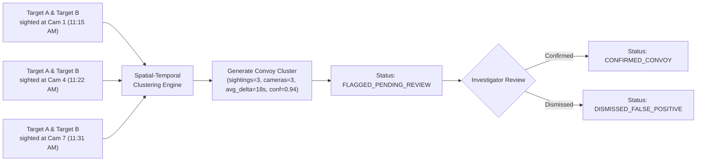

# Forensics, Evidence & Law Enforcement Watchlists — Sybau VMS Pro

> **Operational guide to Forensic Evidence Export, Court FIR Annexures, E-Challans, CCTNS Integration, Watchlists, and Convoy Analysis.**

---

## Table of Contents
1. [Forensic Evidence Packaging & SHA-256 Signatures](#1-forensic-evidence-packaging--sha-256-signatures)
2. [Court FIR Evidence Annexure & E-Challan Citations](#2-court-fir-evidence-annexure--e-challan-citations)
3. [CCTNS Police Integration Service](#3-cctns-police-integration-service)
4. [Stolen Vehicle Hot-List Matching](#4-stolen-vehicle-hot-list-matching)
5. [Wanted Persons & Missing Children Biometric Watchlist](#5-wanted-persons--missing-children-biometric-watchlist)
6. [Cross-Camera Co-Occurrence & Convoy Clustering](#6-cross-camera-co-occurrence--convoy-clustering)
7. [Cross-Camera Subject Trajectory Reconstruction](#7-cross-camera-subject-trajectory-reconstruction)

---

## 1. Forensic Evidence Packaging & SHA-256 Signatures

- **Source**: `backend/services/event_export.py`, `backend/services/forensics.py`

When an officer triggers an evidence export from the live alerts console or search records, the system packages an immutable, cryptographically signed ZIP bundle:

```
evidence_bundle_EVT_89a1b2c3.zip
├── evidence_clip.mp4        # Keyframe-aligned 30s H.264 video segment
├── trigger_frame.jpg        # High-resolution trigger alert snapshot
├── metadata.json            # Machine-readable provenance data
├── signature.sha256         # Streaming SHA-256 cryptographic checksum
└── chain_of_custody.txt     # Legal audit trail of officer identity & timestamps
```

### Checksum Verification
The SHA-256 signature is calculated via streaming 64KB reads directly from the MP4 byte stream, ensuring that any subsequent file corruption or manual frame tampering is immediately detectable during court proceedings.

---

## 2. Court FIR Evidence Annexure & E-Challan Citations

- **Source**: `backend/services/fir_report.py`, `backend/services/challan.py`

### 2.1 Court-Admissible FIR Evidence Annexure
- **Endpoint**: `GET /api/v1/forensics/fir-report/{export_id}`
- **Standard**: Formatted to meet the strict admissibility criteria of the **Indian Evidence Act Section 65B / Bharatiya Sakshya Adhiniyam**.
- **Contents**: Includes official state police seal headers, investigating officer badge numbers, precise GPS coordinates, UTC and IST timestamps, AI detection confidence percentages, trigger snapshot preview, and the master case SHA-256 digital certificate.

### 2.2 E-Challan Traffic Citation Generation
- **Endpoint**: `GET /api/v1/challan/generate/{alert_id}`
- **Features**: Generates an official traffic citation HTML document with an embedded base64 QR code (`qrcode` library) linking to the verified digital violation record, OCR license plate readings, speed calculations, and SHA-256 signature.

---

## 3. CCTNS Police Integration Service

- **Source**: `backend/services/integrations/cctns_service.py`

Sybau VMS Pro integrates with the **Crime and Criminal Tracking Network & Systems (CCTNS)** database to provide instant situational awareness:

### Synced Police Record Attributes
- **Vehicles**: Stolen vehicle FIR number, reporting police station, theft date, registered owner name, charges (e.g. *IPC Section 379 / 392*), warrant status, and investigating officer contact.
- **Persons**: State criminal dossier ID, alias, threat category (*History Sheeter A-Class, Wanted Robbery Suspect, Missing Child*), active non-bailable warrants, lookout circulars, and gang affiliations.

---

## 4. Stolen Vehicle Hot-List Matching

- **Source**: `backend/services/watchlist/matcher.py:check_plate_against_stolen_watchlist()`

During live stream ingestion, every license plate extracted by PaddleOCR/EasyOCR is immediately cross-checked against the `stolen_vehicles_watchlist` and CCTNS feed:
1. Normalizes plate to clean alphanumeric string (`clean_plate()`).
2. Checks local DB active stolen entries and CCTNS State Hot-List.
3. On match, automatically fires an immediate **Critical Priority Stolen Vehicle Alert** over Kafka/WebSocket with live camera pop-up and registered FIR dossier details.
4. Prevents duplicate alert spamming within the same minute via a time-bucketed deduplication token (`hotlist_{plate}_{cam}_{YYYYMMDDHHMM}`).

---

## 5. Wanted Persons & Missing Children Biometric Watchlist

- **Source**: `backend/services/watchlist/matcher.py:check_face_against_person_watchlist()`

Every detected face embedding is continuously evaluated against the active `person_watchlist`:
1. Compares face vector against enrolled 512-D ArcFace / 128-D SFace embeddings using cosine similarity.
2. If similarity $\ge \text{threshold}$ (default: `0.75`), creates a canonical `watchlist_person_detected` event.
3. Automatically retrieves the complete CCTNS criminal history or missing child emergency dossier and presents it to the control room operator.

---

## 6. Cross-Camera Co-Occurrence & Convoy Clustering

- **Source**: `backend/services/co_occurrence.py`
- **Data Model**: `CoOccurrenceCluster` (`co_occurrence_clusters`)

Criminals frequently operate in convoys (e.g. a scout motorcycle preceding an escort SUV) or travel in groups across multiple checkpoints.



### Analysis Pipeline
1. `POST /api/v1/forensics/co-occurrence/analyze`: Scans `UnifiedSighting` records within a sliding time window (default: 15 min).
2. Computes the number of common cameras, sighting counts, and average temporal separation ($\Delta t$ seconds).
3. Clusters with $\ge 2$ cameras and $\ge 3$ co-occurrences are flagged for human review.
4. `POST /api/v1/forensics/co-occurrence/clusters/{uuid}/review`: Allows an investigator to review the cluster and confirm or dismiss the link.

---

## 7. Cross-Camera Subject Trajectory Reconstruction

- **Source**: `backend/services/trajectory.py`

Reconstructs the full geographical journey of a suspect across Surat city:
- **By Sighting ID / Subject ID (`GET /api/v1/forensics/trajectory/{id}`)**: Aggregates all linked sightings chronologically, resolving GPS coordinates from `SURAT_CAMERA_GPS` or database camera locations.
- **By Face / Vehicle Image (`POST /api/v1/forensics/trajectory-by-image`)**: Accepts an uploaded photo, extracts vector embeddings, queries Qdrant for matching historical appearances, and plots the complete multi-hop route on the interactive GIS map.
- **Dynamic Bounding Box Resolution**: If bounding box coordinates were not stored initially, the engine locates the snapshot file on disk and dynamically extracts normalized coordinates `[left, top, width, height]` for UI overlay rendering.
