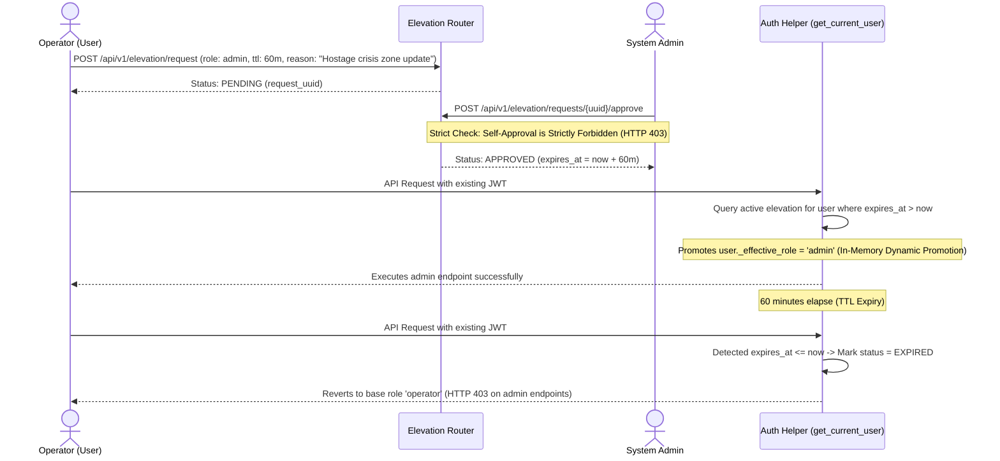

# Security, Access Control & DPDP Compliance — Sybau VMS Pro

> **Comprehensive security architecture, authentication mechanisms, privilege elevation workflows, and legal compliance standards.**

---

## Table of Contents
1. [Authentication & JWT Token Lifecycle](#1-authentication--jwt-token-lifecycle)
2. [Dynamic Privilege Elevation Workflow (FEAT-02)](#2-dynamic-privilege-elevation-workflow-feat-02)
3. [Role-Based Access Control & Camera ACLs](#3-role-based-access-control--camera-acls)
4. [Anti-TOCTOU SSRF Defense (SEC-05)](#4-anti-toctou-ssrf-defense-sec-05)
5. [Path Traversal & Filesystem Security](#5-path-traversal--filesystem-security)
6. [DPDP Act 2023 & Automated Retention Purging](#6-dpdp-act-2023--automated-retention-purging)
7. [Court-Admissible Cryptographic Evidence & Section 65B Compliance](#7-court-admissible-cryptographic-evidence--section-65b-compliance)
8. [Rate Limiting & Brute-Force Defense (SEC-01)](#8-rate-limiting--brute-force-defense-sec-01)
9. [CORS & Production Environment Safeguards](#9-cors--production-environment-safeguards)
10. [Privacy Redaction & Blurring Engine](#10-privacy-redaction--blurring-engine)

---

## 1. Authentication & JWT Token Lifecycle

- **Source**: `backend/auth/helpers.py`, `backend/auth/router.py`

### Token Generation & Verification
- **Algorithm**: `HS256` signed using the secret key in `VMS_SECRET_KEY` (or fallback `SECRET_KEY`).
- **Token Lifetime**: 8 hours (`ACCESS_TOKEN_EXPIRE_MINUTES = 480`).
- **Production Guard**: If `APP_ENV=production`, the server will refuse to start if `VMS_SECRET_KEY` is missing or matches known development placeholder strings (`vms_dev_secret_key_CHANGE_ME_IN_PRODUCTION`).
- **Password Hashing**: Industry-standard `bcrypt` with work factor 12 (`gensalt(rounds=12)`).
- **Mandatory Password Change**: New accounts or reset accounts have `must_change_password=True`. The server intercepts all requests and blocks access to every endpoint except `/api/v1/auth/change-password` until the password is updated to meet complexity rules ($\ge 8$ characters, uppercase, lowercase, digit).

---

## 2. Dynamic Privilege Elevation Workflow (FEAT-02)

- **Source**: `backend/routers/elevation.py`, `backend/auth/helpers.py:143-174`

In tactical police deployments, field officers (viewers/operators) often need temporary access to administrative functions (e.g. changing camera zones during an active hostage crisis or performing urgent evidence exports) without permanently altering user permissions in the database.

### Key Security Invariants
1. **Zero Database Mutation**: The user's underlying `role` column in the `users` table is never altered. Role promotion happens ephemerally during dependency resolution (`user._effective_role`).
2. **Self-Approval Prevention**: An administrator cannot approve their own elevation request (`req.username == current_admin.username` raises HTTP 403).
3. **Automated Expiration**: Upon TTL expiration, `get_current_user` automatically updates the request status to `EXPIRED` and revokes elevated permissions.

---

## 3. Role-Based Access Control & Camera ACLs

The system enforces three primary RBAC tiers:

| Role | Permissions |
|---|---|
| **`viewer`** | Read-only access to live grid, playback streams, ledger records, telemetry, and natural language search. |
| **`operator`** | All `viewer` permissions + add/edit cameras, acknowledge alerts, execute forensic exports, manage watchlists, and submit elevation requests. |
| **`admin`** | All `operator` permissions + user management, hard-delete user erasure, zone polygon editing, AI skill registration, event rules, elevation approvals, and DPDP 90-day retention purges. |

### Camera-Level Access Control (ACL)
Users can be restricted to a subset of cameras via `allowed_cameras` (JSON array of camera IDs, e.g. `["cam_1", "cam_2"]`). `RoleChecker` and stream resolvers verify that the requesting user has explicit permission before serving video streams or snapshots.

---

## 4. Anti-TOCTOU SSRF Defense (SEC-05)

- **Source**: `backend/utils/ssrf.py:validate_proxy_url()`

When proxying HLS streams or resolving remote video URLs, the system guards against **Server-Side Request Forgery (SSRF)** and **Time-of-Check to Time-of-Use (TOCTOU) DNS Rebinding** attacks:

1. **Protocol Whitelist**: Restricts URLs strictly to `http://` and `https://`.
2. **Private IP Blocking**: Resolves **all** IPv4 and IPv6 `A`/`AAAA` DNS records and blocks any connection to:
   - Loopback (`127.0.0.0/8`, `::1`)
   - RFC 1918 Private ranges (`10.0.0.0/8`, `172.16.0.0/12`, `192.168.0.0/16`)
   - Link-Local (`169.254.0.0/16`, `fe80::/10`)
   - Unique Local (`fc00::/7`)
   - Multicast & Broadcast addresses
3. **Internal TLD Rejection**: Blocks unroutable internal hostnames (`.local`, `.internal`, `.lan`, `.home.arpa`, `.invalid`, `.localhost`).

---

## 5. Path Traversal & Filesystem Security

- **Source**: `backend/utils/security.py:safe_join_path()`

All file-serving endpoints (forensic downloads, video recordings, snapshots) resolve absolute canonical paths and verify that the target file resides strictly within the designated storage directory, preventing directory traversal attacks (`../../etc/passwd`).

---

## 6. DPDP Act 2023 & Automated Retention Purging

- **Source**: `backend/services/watchlist/core_router.py`, `backend/recording/retention.py`

In compliance with India's **Digital Personal Data Protection (DPDP) Act 2023**:
- **3-Tier POI Retention Classification**:
  - `ACTIVE_RETENTION_VERIFIED`: First seen $< 75\text{ days}$.
  - `APPROACHING_RETENTION_LIMIT`: First seen $75 \dots 90\text{ days}$ (warning status).
  - `RETENTION_EXCEEDED_PURGE_REQUIRED`: First seen $> 90\text{ days}$ (purge mandated).
- **Admin Purge Control (`POST /api/v1/watchlist/purge-expired`)**: Permanently hard-deletes expired POI records, photographs, and facial vector embeddings from Qdrant, logging the event with admin username and IP address.
- **Alert-Linked Recording Immunity**: Routine video disk cleanup enforces 30-day limits and 85% disk caps, but automatically shields and preserves video recordings linked to verified criminal alerts from deletion.

---

## 7. Court-Admissible Cryptographic Evidence & Section 65B Compliance

- **Source**: `backend/services/event_export.py`, `backend/services/fir_report.py`, `backend/services/challan.py`

Under Indian Law (**Bharatiya Sakshya Adhiniyam / Section 65B of the Indian Evidence Act**), electronic surveillance records must prove an unbroken chain of custody and tamper-evident integrity:

### Evidence Package Architecture (ZIP Bundle)
1. `evidence_clip.mp4`: Keyframe-aligned H.264 video segment extracted directly from raw NVR storage.
2. `trigger_frame.jpg`: High-resolution snapshot captured at the exact moment of threat detection.
3. `metadata.json`: Machine-readable provenance manifest containing camera ID, GPS coordinates, capture timestamp, model name, and operator identity.
4. `signature.sha256`: Cryptographic SHA-256 checksum calculated via 64KB chunked streaming.
5. `chain_of_custody.txt`: Immutable log detailing the exporting officer, client IP address, export timestamp, and legal justification.

### Court FIR Evidence Annexure (`/api/v1/forensics/fir-report/{id}`)
Generates a court-admissible HTML report containing an embedded SHA-256 certificate signature:
$$\text{Hash} = \text{SHA256}(\text{Case Number} \parallel \text{Officer Username} \parallel \text{Timestamp} \parallel \text{Audit ID})$$

---

## 8. Rate Limiting & Brute-Force Defense (SEC-01)

- **Source**: `backend/auth/router.py:23-64`
- **Policy**: In-memory IP tracking with sliding window limits.
- **Threshold**: 10 failed login attempts within a 5-minute window triggers a **15-minute lockout**.
- **Response**: Returns HTTP 429 (`Too Many Requests`) with an accurate `Retry-After` header.

---

## 9. CORS & Production Environment Safeguards

- **Development**: Permissive CORS for local Vite development (`http://localhost:5173`).
- **Production (`APP_ENV=production`)**: Enforces non-wildcard `CORS_ALLOWED_ORIGINS` (raises a fatal `RuntimeError` on startup if `*` or empty is detected), preventing unauthorized cross-origin browser attacks.

---

## 10. Privacy Redaction & Blurring Engine

- **Source**: `backend/ai/privacy/redactor.py`, `configs/privacy.json`

Provides 6 privacy protection modes:
1. `FULL_REDACTION`: Blurs all detected faces and vehicle license plates using Gaussian blur ($51 \times 51$ kernel).
2. `FACE_ONLY`: Blurs biometric facial regions while preserving vehicle license plates for traffic monitoring.
3. `PLATE_ONLY`: Blurs license plates while preserving facial recognition for POI tracking.
4. `FORENSIC_OVERRIDE`: Authorized export override unmasking evidence for court submission.
5. `DYNAMIC_ZONE_REDACTION`: Applies privacy blurring strictly within designated public privacy zones (e.g. residential windows).
6. `DISABLED`: Standard raw video passthrough.
