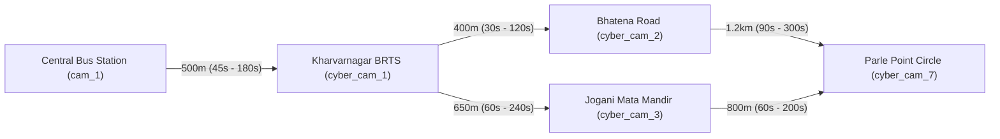

# Camera Topology & Predictive Escape Routing — Sybau VMS Pro

> **Technical specification for the Camera Network Topology Graph, Interactive Canvas Editor, and Predictive Next-Hop Escape Routing Engine.**

---

## Table of Contents
1. [Overview & Core Concepts](#1-overview--core-concepts)
2. [Topological Graph Data Model](#2-topological-graph-data-model)
3. [Interactive Canvas & Coordinate Persistence](#3-interactive-canvas--coordinate-persistence)
4. [Directed Transit Edges & Travel Window Calibration](#4-directed-transit-edges--travel-window-calibration)
5. [Predictive Next-Hop Escape Routing Algorithm](#5-predictive-next-hop-escape-routing-algorithm)
6. [Interception Probability & ETA Calculation](#6-interception-probability--eta-calculation)
7. [Terminal Boundary & Dead-End Handling](#7-terminal-boundary--dead-end-handling)
8. [Real-Time Predictive Transit Alerts](#8-real-time-predictive-transit-alerts)

---

## 1. Overview & Core Concepts

In real-world city surveillance (e.g. Surat, Gujarat), individual CCTV cameras do not operate in isolation. They form a connected spatial network of roads, intersections, BRTS corridors, and highway exits.

The **Camera Topology Subsystem** (`backend/routers/topology.py`, `backend/services/topology/escape_router.py`, `frontend/src/components/TopologyEditor.jsx`) transforms disconnected camera streams into an intelligent, directed transit graph:



Key capabilities:
- **Interactive Visual Editor**: Drag-and-drop 2D canvas editor allowing operators to map physical camera layouts visually.
- **Calibrated Transit Windows**: Configures minimum and maximum realistic travel times between camera pairs based on speed limits and traffic conditions.
- **Zero-GPU Predictive Routing**: Uses graph traversal and kinematic velocity bounds ($v = \Delta d / \Delta t$) to forecast suspect escape routes in $<5\text{ms}$.

---

## 2. Topological Graph Data Model

The graph consists of two database entities in PostgreSQL:

### 2.1 `CameraNode` (`camera_nodes`)
Represents an individual camera vertex in the graph:
- `camera_id` (PK, FK to `cameras.id`): Unique camera identifier.
- `label`: Display name (e.g. `"Kharvarnagar BRTS Junction"`).
- `map_x`, `map_y`: Visual coordinates on the 2D layout canvas.
- `geo_lat`, `geo_lng`: Real-world GPS coordinates for GIS integration.
- `zone_group`: Geographic zone grouping (e.g. `"Main City"`, `"Highway Ring Road"`, `"Transit Hub"`).
- `is_active`: Operational status flag.

### 2.2 `CameraEdge` (`camera_edges`)
Represents a directed physical transit route connecting two camera nodes:
- `source_camera_id` (FK to `cameras.id`): Starting camera node.
- `target_camera_id` (FK to `cameras.id`): Downstream destination camera node.
- `distance_meters`: Physical road distance in meters (default: `500.0m`).
- `expected_transit_sec_min`: Fastest realistic transit time (seconds, e.g. at green lights / high speed).
- `expected_transit_sec_max`: Slowest realistic transit time (seconds, e.g. in heavy traffic).
- `allowed_directions`: JSON array of heading vectors (e.g. `["forward", "north", "east"]`).
- `is_active`: Edge active flag.

---

## 3. Interactive Canvas & Coordinate Persistence

- **Frontend Component**: `frontend/src/components/TopologyEditor.jsx`, `TopologyEditor.css`
- **API Endpoint**: `PUT /api/v1/topology/nodes/{camera_id}`

The Topology Editor provides:
1. **Interactive SVG/HTML5 Canvas**: Displays camera nodes with status halos (`#00e676` online, `#ff5252` threat detected).
2. **Smooth Drag-and-Drop**: Operators can reposition camera nodes intuitively. Coordinate updates are debounced and saved automatically to PostgreSQL via `PUT /api/v1/topology/nodes/{id}`.
3. **Directed Connecting Arrows**: Visualizes configured edges with transit time pill badges.
4. **Canonical Reset**: `POST /api/v1/topology/reset-layout` rearranges all active nodes into a canonical circular geometry ($x = c_x + r \cos \theta, y = c_y + r \sin \theta$) while preserving all underlying edge transit rules.

---

## 4. Directed Transit Edges & Travel Window Calibration

- **API Endpoints**: `POST /api/v1/topology/edges`, `DELETE /api/v1/topology/edges/{id}`

Operators configure realistic boundaries for each transit route:
- **Distance ($d$)**: Road distance between cameras.
- **Minimum Transit Window ($t_{\text{min}}$)**: Defines the earliest possible second a fleeing suspect could arrive at the next camera ($t_{\text{min}} = \text{distance} / v_{\text{max}}$).
- **Maximum Transit Window ($t_{\text{max}}$)**: Defines the latest second before the suspect is considered to have stopped, turned around, or taken an unmonitored side alley.

---

## 5. Predictive Next-Hop Escape Routing Algorithm

- **Source**: `backend/services/topology/escape_router.py:predict_next_hop_escape_routes()`

When a target (stolen vehicle, fleeing suspect) is sighted at a camera checkpoint, the routing engine executes:

```python
# 1. Resolve source camera and active outgoing edges
outgoing_edges = db.query(CameraEdge).filter(
    CameraEdge.source_camera_id == source_cam_id,
    CameraEdge.is_active == True
).all()

# 2. Convert observed vehicle speed to m/s
speed_ms = max(5.0, (observed_speed_kmh * 1000.0) / 3600.0)

# 3. For each downstream connected camera:
for edge in outgoing_edges:
    dist_m = edge.distance_meters
    nominal_sec = dist_m / speed_ms
    
    transit_min_sec = int(max(15, nominal_sec * 0.75))
    transit_max_sec = int(max(transit_min_sec + 20, nominal_sec * 1.35))
    
    eta_start = departure_time + timedelta(seconds=transit_min_sec)
    eta_end = departure_time + timedelta(seconds=transit_max_sec)
```

---

## 6. Interception Probability & ETA Calculation

The algorithm assigns an **Interception Probability** score ($0.0 \dots 1.0$) based on:
1. **Heading Alignment**: Compares observed exit vector (`north`, `south`, `east`, `west`) against allowed edge directions. Aligned routes receive a base probability of `0.85 - 0.95`. Non-aligned routes receive `0.45`.
2. **Transit Distance & Speed Match**: Shorter, direct road links receive higher priority.
3. **Priority Categorization**:
   - `HIGH`: Intercept probability $\ge 0.75$ (Primary PCR van intercept choke-point).
   - `MEDIUM`: Intercept probability $< 0.75$ (Secondary perimeter monitor).

---

## 7. Terminal Boundary & Dead-End Handling

If a camera has no outgoing edges configured:
- If the rest of the network has configured topology, the engine detects the node as a **Terminal Boundary Checkpoint** (`is_dead_end = True`) and informs the operator that the suspect has entered a perimeter boundary or dead-end with no downstream fixed cameras.
- In unconfigured or uninitialized networks, the engine generates an automatic **Spatial Neighborhood Fallback** based on adjacent camera GPS coordinates.

---

## 8. Real-Time Predictive Transit Alerts

- **Endpoint**: `POST /api/v1/topology/predict`
- **Output**: Broadcasts an automated tactical alert over Kafka / WebSocket:

```json
{
  "type": "PREDICTIVE_TRANSIT",
  "source_camera_id": "cyber_cam_1",
  "target_camera_id": "cyber_cam_7",
  "target_identifier": "KA51MB8811",
  "target_type": "vehicle",
  "distance_meters": 650.0,
  "expected_window_start": "2026-08-16T17:15:45+05:30",
  "expected_window_end": "2026-08-16T17:18:10+05:30",
  "message": "📡 PREDICTIVE TRANSIT ALERT: Target 'KA51MB8811' (vehicle) departed Kharvarnagar BRTS Junction. Expected at Parle Point Circle between 17:15:45 and 17:18:10.",
  "timestamp": "2026-08-16T17:15:00+05:30"
}
```
